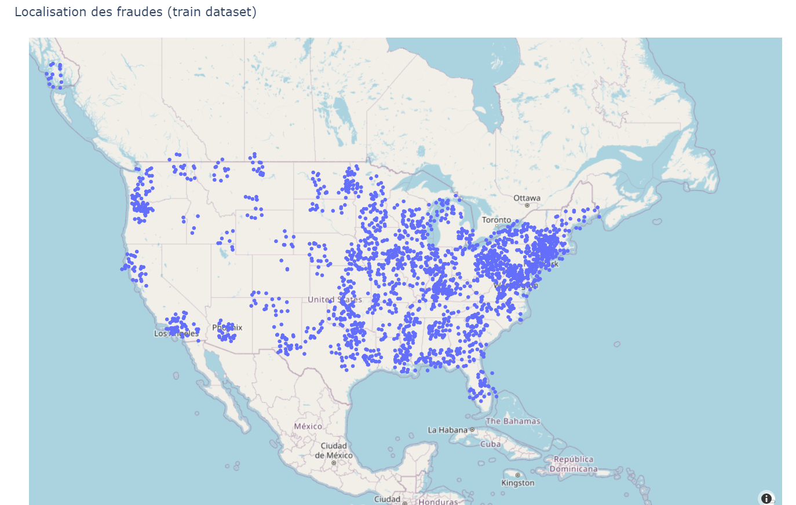

<!-- ###################################################################### -->
<!-- ###################################################################### -->
# EDA
* Go to ``98_EDA`` directory and open ``eda.ipynb`` 
* If needed, open a terminal in VSCode

```bash
conda install numpy pandas seaborn matplotlib plotly nbformat -c conda-forge -y
```

* ``Clear All Outputs`` (it does'nt hurt)
* ``Restart`` the kernel
* Approve when VSCode ask to install ``ipykernel`` in order to please Python
* You should be good to go
* ``Run All``
* Read the comments, at the end a map with the spots in US should be displayed

<p align="center">

<p>


<!-- ###################################################################### -->
<!-- ###################################################################### -->
# What's next ?
* Go to the directory `02_mlflow_tracking_server` and read the [README.md](./../02_mlflow_tracking_server/README.md) file 
    * The previous link (README.md) may not work on GitHub but it works like a charm locally in VSCode or in a Web browser
    * [Try this](https://github.com/40tude/fraud_detection_2/tree/main/01_model_and_data/01_model_and_data_ops/02_mlflow_tracking_server)

