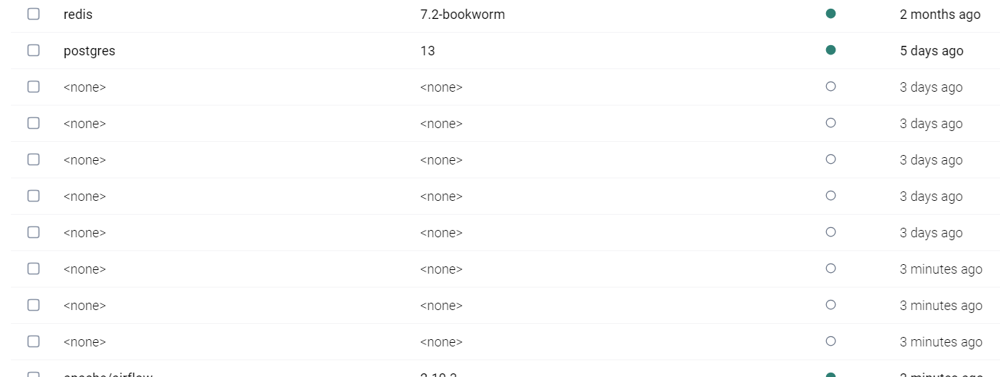

<!-- 
Dans le répertoire où y a le docker-compose.yml

docker-compose down --volumes --remove-orphans --rmi all
docker image prune -f


# Supprimer le container dont on a les id
docker ps
docker rm 8e2

# Supprimer les images dont on a les Id
docker rmi ab4


docker ps -a
docker volume ls
docker images
Après on peut supprimer le répertoire installer Airflow ailleurs


docker compose down             # pour arrêter 
docker compose down -v          # supprime les volumes des services Airflow
docker compose up
docker compose up --build       # Recrée les conteneurs et force la création des volumes

Si on a des volumes et on sait pas à quoi il servent
docker ps -a --format "{{.ID}}: {{.Names}} ({{.Mounts}})"


Verifier si docker-compose est installé
docker exec -it 08_airflow-airflow-webserver-1 /bin/bash
docker-compose --version

Lister et supprimer les images Name = NONE
docker images --filter "dangling=true"
docker image prune -f
 -->

 <!-- 
liste des containers    actifs          docker ps
                        tous            docker ps -a
                        tous par id     docker ps -qa
                        actifs par nom  docker ps --format "{{.Names}}"
                                        docker ps -a --format "{{.ID}} {{.Names}}"
                                        docker ps --filter "status=exited"

liste des images                        docker image ls 
                                        docker image ls --format "{{.Repository}}"

liste des volumes                       docker volume ls
                                        docker volume prune


Depuis 08_airflow\                                                        docker exec -it 08_airflow-airflow-webserver-1 /bin/bash
Dans le container airflow, depuis le répertoire /opt/extractor_sql        docker-compose --env-file ./app/.env run extractor_sql bash

docker-compose --env-file /opt/extractor_sql/app/.env -f /opt/extractor_sql/docker-compose.yml run extractor_sql bash


On est dans /home/app mais c'est vide
Y a même pas le fichier requirements.txt


# Copie pas les fichiers cachés type .env
docker run --rm -v C:/Users/phili/OneDrive/Documents/Programmation/fraud_detection_2/06_extractor_sql_dag/app:/source -v 08_airflow_shared_app:/mnt busybox sh -c "cp -r /source/* /mnt/" 

# Copie .env
docker run --rm -v C:/Users/phili/OneDrive/Documents/Programmation/fraud_detection_2/06_extractor_sql_dag/app:/source -v 08_airflow_shared_app:/mnt busybox sh -c "cp -r /source/. /mnt/"


 -->v


# Objective
* Orchestrate with DAG in Airflow the ``fraud_detection_2`` modules running in a Docker container.
* Here we use `extractor_sql` as an example.

# Installation
<!-- * Current version of Airflow = 2.10.3 -->
<!-- * https://airflow.apache.org/docs/apache-airflow/stable/howto/docker-compose/index.html -->

* Make sure **Docker Desktop is running**
* In VSCode, create directory ``./08_airflow``
* Open an integrated terminal in it 

```powershell
Invoke-WebRequest -Uri 'https://airflow.apache.org/docs/apache-airflow/2.10.3/docker-compose.yaml' -OutFile 'docker-compose.yaml'
```

* Open docker-compose.yml in VSCode
* Search for ``airflow-webserver``
* Replace ``8080:8080`` with ``8081:8080`` 
* Redirect host ``8081`` port  to ``8080`` port of the container
    * Indeed, Jenkins is already on ``8080`` 

```yaml
airflow-webserver:
    <<: *airflow-common
    command: webserver
    ports:
      - "8081:8080"
```
* Modify the line

```yaml
AIRFLOW__CORE__LOAD_EXAMPLES: 'false'
```

* Add the `/data` line

```yaml
volumes:
    - ${AIRFLOW_PROJ_DIR:-.}/dags:/opt/airflow/dags
    - ${AIRFLOW_PROJ_DIR:-.}/logs:/opt/airflow/logs
    - ${AIRFLOW_PROJ_DIR:-.}/config:/opt/airflow/config
    - ${AIRFLOW_PROJ_DIR:-.}/plugins:/opt/airflow/plugins
    - ${AIRFLOW_PROJ_DIR:-.}/data:/opt/airflow/data
```

* Save ``docker-compose.yml``


In VSCode integrated terminal

```powershell
New-Item -ItemType Directory -Path ./data
New-Item -Path .env -ItemType File
Set-Content -Path .env -Value "AIRFLOW_UID=50000" 
docker compose up airflow-init                      
```


<p align="center">

<p>


<p align="center">

<p>

* Pay attention : ``airflow`` user account created with password ``airflow``


```powershell
docker compose up

```
* There is no ``-d`` at the end of the line. The terminal will be dedicated and will display the log messages. 

* The first start may take some time.

* Log on ``http://localhost:8081`` with your browser
    * (airflow, airflow)

<p align="center">

<p>

<p align="center">

<p>


## In case of trouble
At this point I recommend
1. Double check you saved ``docker-compose.yml``
1. **IMPORTANT :** Open a terminal in ``./08-airflow``
```powershell
docker-compose down --volumes --remove-orphans --rmi all
docker image prune -f
docker compose up airflow-init 
docker compose up 
```

### Don't go beyond this point until you can connect to [http://localhost:8081](http://localhost:8081) and reach the page is empty


If the time is off by 1H00 it can be easily updated
* See also this page [page](https://airflow.apache.org/docs/apache-airflow/stable/authoring-and-scheduling/timezone.html)


<p align="center">

<p>


<!-- ###################################################################### -->
<!-- ###################################################################### -->
# First DAG

<!-- ###################################################################### -->
## 1. Create a DAG ``./dags/test01_dag.py``  

```python
# test01_dag.py

import ccxt
import json
import logging
from airflow import DAG
from datetime import datetime
from airflow.operators.python import PythonOperator


# -----------------------------------------------------------------------------
def fetch_btc_infos() -> None:
    hitbtc = ccxt.hitbtc()
    ticker = hitbtc.fetch_ticker("BTC/USDT")
    now = datetime.now().timestamp()
    filename = f"{now}.json"
    with open(f"./data/{filename}", "w") as f:
        json.dump(ticker, f)
    logging.info(f"BTC dumped into {filename}")


with DAG("test01", start_date=datetime(2024, 1, 1), schedule_interval="@hourly", catchup=False) as dag:
    fetch_btc_infos = PythonOperator(task_id="fetch_btc_infos", python_callable=fetch_btc_infos)
    fetch_btc_infos
```


* Switch back to the Airflow web page, hit ``F5``
* Does'nt work in Airflow
* Indeed the `ccxt` is missing
* Click on the message in red to unroll it and get more info

<p align="center">

<p>


<!-- ###################################################################### -->
## 2. Install missing modules in Airflow image

* Create ``Dockerfile`` close to ``docker-compose.yaml``

```dockerfile
# Dockerfile

FROM apache/airflow:2.10.3
COPY requirements.txt .
RUN pip install -r requirements.txt
```


<!-- ###################################################################### -->
## 3. Create ``requirements.txt`` close to ``Dockerfile``

```python
# requirements.txt

ccxt
```


<!-- ###################################################################### -->
## 4. Update ``docker-compose.yml``

* In the `x-airflow-common:` section uncomment the line `build...`

```yaml
image: ${AIRFLOW_IMAGE_NAME:-apache/airflow:2.10.3}
build: .
```


<!-- ###################################################################### -->
## 5. Stop-Restart ``docker-compose``

* Open a terminal where the ``docker-compose.yml`` is
    * Opening the terminal in the correct directory is **IMPORTANT**

```powershell
docker compose down 
```

<p align="center">

<p>

* In the terminal where we `docker compose up ` earlier, Airflow processes should be stopped.
* We rebuild the image so that it take into account the updated version of ``docker-compose`` (including ``Dockerfile`` and ``requirements.txt``)

```powershell
docker compose up --build
```

* Now the DAG `test01` is available and it can run
    * If `Trigger DAG` is pressed then ``json`` are fetched and downloaded in ``./data``
    * This is the reason why we create a volume earlier (`${AIRFLOW_PROJ_DIR:-.}/data:/opt/airflow/data`)

<p align="center">

<p>


<!-- ###################################################################### -->
<!-- ###################################################################### -->
# Run a Docker container

* We use a Docker Operator


<!-- ###################################################################### -->
## 1. Configure Docker to accept TCP connections at tcp://0.0.0.0:2375

* In Docker click on settings (top left, wheel)
* General then check ``Expose deamon on TCP...``

<p align="center">

<p>


<!-- ###################################################################### -->
## 2. Restart Docker Desktop

* This works but it takes time...


<!-- ###################################################################### -->
## 3. Edit ``docker-compose.yml``

* Find the ``x-airflow-common`` section and its ``environment`` key and add `DOCKER_HOST` as shown below

```yaml
x-airflow-common:
  &airflow-common
  # In order to add custom dependencies or upgrade provider packages you can use your extended image.
  # Comment the image line, place your Dockerfile in the directory where you placed the docker-compose.yaml
  # and uncomment the "build" line below, Then run `docker-compose build` to build the images.
  image: ${AIRFLOW_IMAGE_NAME:-apache/airflow:2.10.3}
  build: .
  environment:
    &airflow-common-env
    DOCKER_HOST: tcp://host.docker.internal:2375
    ...
```


<!-- ###################################################################### -->
## 4. Create a new DAG ``./dags/test02_dag.py``

````python
# test02_dag.py

from airflow import DAG
from airflow.providers.docker.operators.docker import DockerOperator
from datetime import datetime, timedelta

default_args = {
    "owner": "airflow",
    "depends_on_past": False,
    "retries": 1,
    "retry_delay": timedelta(minutes=5),
}

with DAG(
    dag_id="test02",  # what we see in the Web UI
    default_args=default_args,
    description="Exec BusyBox, wait 10 sec.",
    schedule_interval=None,
    start_date=datetime(2024, 1, 1),
    catchup=False,
) as dag:

    run_busybox = DockerOperator(
        task_id="run_busybox",
        image="busybox",  # Hello world was too fast, better results when testing with the excellent busybox
        api_version="auto",
        auto_remove=True,  # Remove container once done
        docker_url="tcp://host.docker.internal:2375",  # Connection via TCP
        network_mode="bridge",  # Network mode
        command="sh -c 'echo Starting BusyBox && sleep 10 && echo Stopping BusyBox'",  # Command executed in the container
    )

````


<!-- ###################################################################### -->
## 5. Extend ``requirements.txt`` 

```
ccxt
apache-airflow-providers-docker
```


<!-- ###################################################################### -->
## 6. Stop-Restart ``docker-compose``

* Open a terminal where the ``docker-compose.yml`` is


```powershell
docker compose down 
docker image prune -f
```

* In the terminal where we `docker compose up ` earlier, Airflow processes should be stopped.
* We rebuild the image so that it take into account the updated version of ``docker-compose`` (including ``Dockerfile`` and ``requirements.txt``)

```powershell
docker compose up --build
```

* Now the DAG `test02` is available and it can run

<p align="center">

<p>

In the logs we can find the messages

<p align="center">

<p>


<!-- ###################################################################### -->
## 7. Stop and clean Airflow images, containers, volumes

* In a terminal where the ``docker-compose.yml`` is

```powershell
docker-compose down --volumes --remove-orphans --rmi all
docker image prune -f
```

* Indeed many it seems there are many images which can be deleted 

<p align="center">

<p>


<!-- ###################################################################### -->
<!-- ###################################################################### -->
# Running one of the ``fraud_detection_2`` modules in a Docker container

* For demonstration purposes we will run `extractor_sql` module.


<!-- ###################################################################### -->
## 1. As with benchmarks, never assume, always check

* In order to make sure, later we can concentrate on Airflow rather than the possible issues with the module we must first make sure we can build and run the module in a container
* Open the bucket on AWS where the ``validated.csv`` file is stored

<p align="center">

<p>


* Download it, save it as ``validated_old.csv`` and open it in notepad. 
    * Below we see the header and only 2 lines

<p align="center">

<p>


* Open `06_extractor_sql\app\extractor_03.py` and at the top of the file make sure `k_DEMO_MODE` and `k_DEBUG_MODE` are set to True
    * Doing so we are sure only one record at a time is extracted for the SQL database

```python
# In DEMO_MODE we force 25% of the records to have a non-NULL 'fraud_confirmed' feature
# Otherwise all records having a non-NULL 'fraud_confirmed' feature are used to create the CSV file
k_DEMO_MODE = True

# In DEBUG_MODE we force 1 record have a non-NULL 'fraud_confirmed' feature
k_DEBUG_MODE = True
```


* Open a terminal in the `06_extractor_sql` directory

```powershell
docker-compose down --volumes --remove-orphans --rmi all
docker image prune -f
```
* Don't worry too much if you see messages about `AWS_ACCESS_KEY_ID` blablabla...

* Let's build and run the module in a container
    * Up to this point it is still a two steps process but we will fix that soon

```powershell
.\build_img.ps1
.\run_app.ps1
```

* Open the bucket on AWS where the ``validated.csv`` file is stored
* Download it, save it as ``validated.csv`` and open it in notepad. 
    * Below we see the header and 3 lines (instead of 2 previously)

<p align="center">

<p>

* We now know that building the image, instantiating a container and running the ``extract_sql`` module all work. If we have any problems, they'll come from elsewhere 

* Clean up the crime scene


```powershell
docker-compose down --volumes --remove-orphans --rmi all
docker image prune -f
```


<!-- ###################################################################### -->
## 2. Setup
* **MAKE A COPY** : we never know...
* Copy paste rename the ``../06_extractor_sql`` directory in ``../06_extractor_sql_dag``


<!-- ###################################################################### -->
## 3. Use ``.env`` file rather than ``secrets.ps1``

* This is for the same reasons as when we modified another module in the fraud_detection_2 project, so that we could test it within a container. See this [README.md](../05_logger_sql_testable/README.md) if necessary.  
* Rename ``06_extractor_sql_dag\app\secrets.ps1`` as ``06_extractor_sql_dag\app\.env``
* Update its content such that is looks like below (no space around `=` etc.)

```python
# .env

# SQL database on Heroku
LOGGER_SQL_URI=postgresql://ucn...

# AWS access to S3 bucket
AWS_ACCESS_KEY_ID=AKI...
AWS_SECRET_ACCESS_KEY=vtL...
```


<!-- ###################################################################### -->
## 4. Update the content of `./run_app.ps1`

```powershell
# run_app.ps1

# . "./app/secrets.ps1"
# docker-compose up -d
docker-compose --env-file ./app/.env up extractor_sql -d
```

### A quick check never hurt

* In VSCode open another terminal in `06_extractor_sql_dag`
* Check that none of the environment variable of ``.env`` are defined

```powershell
ls env:AWS* 
```


<p align="center">

<p>


```powershell
.\build_img.ps1
.\run_app.ps1
```

* Open the bucket on AWS where the ``validated.csv`` file is stored
* Download it, save it as ``validated.csv`` and open it in notepad. 
    * Below we see the header and 4 lines (instead of 3 previously)

<p align="center">

<p>

* This means we can now get rid of the ``secrets.ps1`` files and use the ``.env`` files instead.

* Clean up the crime scene 
    * From the same terminal, in ``06_extractor_sql_dag`` directory 

```powershell
docker compose down --volumes --remove-orphans --rmi all
docker image prune -f
```


<!-- ###################################################################### -->
## 5. Update the content of `06_extractor_sql_dag/docker-compose.yml`

* The main differences are in the 
    1. ``build`` section : It explains how to build the container if it does not exist yet
    1. ``environment`` section : It tells where to find the ``.env`` file. This will simplfy the command line to run the module.
    1. Based on what I did in `99_tooling\25_DinD` there is now a Docker named volume. It is of no help here. Don't worry to much. Read this [README.md](..//99_tooling/25_DinD/README.md) if you really want.

```yaml
# docker-compose 

services:
  extractor_sql:
    image: extractor_sql_dag_img
    build:
      context: .
      dockerfile: docker/Dockerfile
    container_name: extractor_sql_dag
    env_file:
      - ./app/.env
    volumes:
      - extractor_sql_dag_shared_app:/home/app      # What is mounted : local directory
    working_dir: /home/app
    command: python extractor_03.py                   

volumes:
  extractor_sql_dag_shared_app:                     # will become 08_airflow_extractor_sql_dag_shared_app
                                                    # airflow_dir_name_ + volume_name

```
* Rename or delete ``06_extractor_sql_dag\build_img.ps1``

* Edit ``06_extractor_sql_dag\run_app.ps1``
    * It no longer uses the ``--env-file`` parameter (see the `env_file:` section in `docker-compose.yml`)
    * It uses ``run`` on the ``extractor_sql`` so that it will clean the container at the end

```powershell
#run_app.ps1

docker-compose run --rm extractor_sql
```


### A quick check never hurt

* Check and make sure no Airflow and/or any ``extractor_sql`` related containers are running (`docker ps -a`, `docker rm 6g7`)
* Double check no ``extractor_sql_dag_img`` image is available (`docker image ls`, `docker rmi 125`)
* In VSCode open a terminal in `06_extractor_sql_dag` directory

```powershell
./run_app.ps1
```

* Since the image is not yet available the `build` section of the `docker-compose.yml` is used to build one

<p align="center">

<p>

* If we ``run_app`` again, since the image is available then it will not be rebuilt and the container will start right away

```powershell
./run_app.ps1
```

<p align="center">

<p>


* Open the bucket on AWS where the ``validated.csv`` file is stored
* Download it, save it as ``validated.csv`` and open it in notepad. 
    * More lines have been added

<p align="center">

<p>

* This means we can get rid of the ``build_img.ps1``.

* Clean up the crime scene (from the same terminal)

```powershell
docker-compose down --volumes --remove-orphans --rmi all
docker image prune -f
```


### Let's take a break

Believe me... To make a long story short we did nothing yet. We prepared the content of the ``06_extractor_sql_dag`` so that we can run it from a Windows terminal (``./run_app.ps1``) and hopefully, embed it in a DAG. Just to make sure we are on the same page here is how files are organized in the module directory.

```powershell

06_extractor_sql_dag
│   docker-compose.yml
│   run_app.ps1
│
├───app
│      .env
│      extractor_03.py
│
└───docker
        Dockerfile
        requirements.txt

```

Now come the fun part...


<!-- ###################################################################### -->
## 5. Update the content of ``docker-compose.yml`` of the Airflow container

We are talking about : ``./08_airflow/docker-compose.yml``

### 1. Add the named volume at the end of the file

```yaml
volumes:
  postgres-db-volume:
  extractor_sql_dag_shared_app:
    driver: local
```

### 2. Map the named volume in `x-airflow-common:` section

```yaml
volumes:
    - extractor_sql_dag_shared_app:/home/app
    - ${AIRFLOW_PROJ_DIR:-.}/dags:/opt/airflow/dags
    - ${AIRFLOW_PROJ_DIR:-.}/logs:/opt/airflow/logs
    - ${AIRFLOW_PROJ_DIR:-.}/config:/opt/airflow/config
    - ${AIRFLOW_PROJ_DIR:-.}/plugins:/opt/airflow/plugins
```

### 3. Configure permissions for the named volume in `x-airflow-common:` section


```yaml
environment:
    &airflow-common-env
    AIRFLOW__CORE__DEFAULT_TASK_RUN_USER: root
    DOCKER_HOST: tcp://host.docker.internal:2375
    AIRFLOW__CORE__EXECUTOR: CeleryExecutor
```


<!-- ###################################################################### -->
## 6. Synchronizing files manually

* This one is really bad
* I need to double check how to avoid it
* This is because (don't ask me why), as far as I know, Docker does not copy files from the Windows host into the named volumed used by Airflow
* So we have to do it ourselves 
* **IMPORTANT** : Please understand and bear in mind that this is not an automatic process. If the code of the module or the ``.env`` file are modified then the hand made synchronization must be done again. 
* I did'nt find yet a solution 
* Here is the miserable process...

```powershell
docker volume ls
```

<p align="center">

<p>

I can see the named volume `08_airflow_extractor_sql_dag_shared_app`


```powershell
docker run --rm `
  -v C:/Users/phili/OneDrive/Documents/Programmation/fraud_detection_2/06_extractor_sql_dag/app:/source `
  -v 08_airflow_extractor_sql_dag_shared_app:/mnt `
  busybox sh -c "cp -r /source/. /mnt/"
```
* Pay attention to the backticks at the end of the lines. 
* In Linux shells they use `\`
* There is one space before and no space after
* I tried to use relative path without success (I haven't spent 2 hours on the subject either) 


#### Let's check if it worked

```powershell
docker ps -a --format "{{.ID}}:    {{.Names}}"      # of docker ps works as weel
```

I can see `08_airflow-airflow-worker-1`

<p align="center">

<p>


```powershell
docker exec -it 08_airflow-airflow-worker-1 bash
ls -al /home/app
```

<p align="center">

<p>

I can that see ``.env`` and ``extractor_03.py`` are in the named volume. 


<!-- ###################################################################### -->
## 7. Create a DAG

1. Add `docker` and `python-dotenv` to the Airflow ``requirements.txt``

```powershell
# requirements.txt

ccxt
apache-airflow-providers-docker
docker
python-dotenv
```


2. Create `08_airflow\dags\extractor_sql_dag.py`

```python
# extractor_sql_dag.py

from airflow.providers.docker.operators.docker import DockerOperator
from airflow import DAG
from datetime import datetime
from docker.types import Mount
from dotenv import dotenv_values

# Charger les variables depuis le fichier .env et en créer une chaine car Airflow ne fait pas son travail
# See env_file=env_vars_str in DockerOperator() while it should be env_file=env_path
# Read this https://github.com/apache/airflow/discussions/29990
env_path = "/home/app/.env"
env_vars_dict = dotenv_values(env_path)  # Retourne un dictionnaire
env_vars_str = "\n".join([f"{key}={value}" for key, value in env_vars_dict.items()])  # Convertir en chaîne

default_args = {
    "owner": "airflow",
    "depends_on_past": False,
    "retries": 1,
}

with DAG(
    "extractor_sql",
    default_args=default_args,
    description="Run extractor SQL script in a Docker container",
    schedule_interval=None,
    start_date=datetime(2024, 1, 1),
    catchup=False,
) as dag:

    run_extractor = DockerOperator(
        task_id="run_extractor",
        image="extractor_sql_dag_img",
        container_name="extractor_sql_dag",
        command="python /home/app/extractor_03.py",
        env_file=env_vars_str,
        mounts=[
            Mount(source="08_airflow_extractor_sql_dag_shared_app", target="/home/app", type="volume"),
        ],
        network_mode="bridge",
        auto_remove=True,
    )

    run_extractor

```


<!-- ###################################################################### -->
## 8. Testing the extractor_sql DAG

1. Restart Airflow

```powershell
docker compose down
docker-compose up --build
```

2. Log on ``http://localhost:8081`` with your browser
    * (airflow, airflow)


3. Find the DAG in the list and trigger it manually

<p align="center">

<p>

Inspect the logs

<p align="center">

<p>

Check on AWS S3 the date and time of the ``validated.csv`` file
<p align="center">

<p>

Download and open it. Compare the data with the ones in the logs

<p align="center">

<p>


<!-- ###################################################################### -->
<!-- ###################################################################### -->
# Conclusion

- Taking a step back to reflect on what we’ve accomplished after the first two initial tests with Airflow:
- We have a module that connects to a database to extract specific observations. It then slightly transforms these observations and saves them into a `.csv` file on an AWS S3 bucket.  
- This module can be invoked from a PowerShell terminal and runs inside a Docker container.
- The idea is to create a method that allows us to reuse this module, within its container, by encapsulating it in a DAG so it can be integrated into a higher-level orchestration.
- One key principle is to avoid modifying the module’s source code or the configuration of its container. 
- After encountering numerous issues with Airflow, additional tests were conducted to better understand Docker in Docker, environment variable passing, volume mapping, and so on. Refer to this [README.md](../99_tooling/25_DinD/README.md) if needed.
- Leveraging our experience, we revisited Airflow and now follow a 4-step method:
    1. **Update the `docker-compose.yml` content** of the Airflow container. This step only needs to be done once.
    2. **Synchronize files manually** between the Windows 11 host and the named volume. This is the most frustrating and disappointing step. As far as we know, this step must be repeated every time changes are made to the directory containing the module's sources or to the `.env` file with credentials.
    3. **Create a DAG:** This step is almost identical across modules since the DAG only triggers a container.
    4. **Test the DAG:** Simply click the manual trigger and check the logs.

What has been developed here for the `extractor_sql` module should be easily applicable to other modules if needed.


<!-- ###################################################################### -->
<!-- ###################################################################### -->
# What's next ?
* Go to the directory `./09_evidently` and read the [README.md](../09_evidently/README.md) file 
* The previous link (``README.md``) may not work on GitHub but it works like a charm locally in VSCode or in a Web browser
* [Try this](https://github.com/40tude/fraud_detection_2/tree/main/09_evidently)
