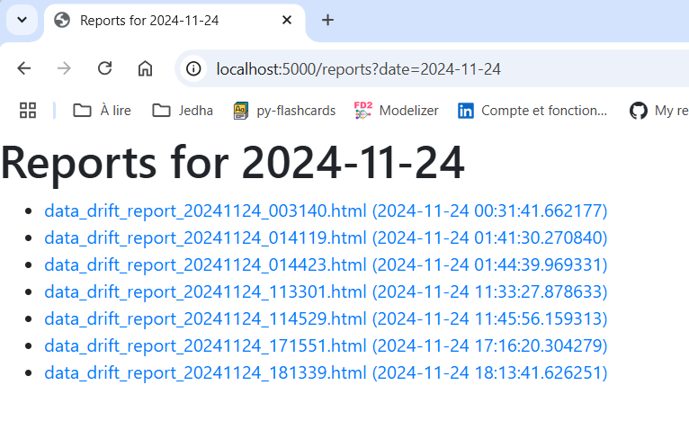

# Vérifications préliminaires

* Le serveur et le client ont été développés
* On vérifie leur fonctionnement

## Serveur
1. File Exploer
1. Aller dans ./fraud_detection_2/01_model_and_data/02_model_and_data_care/02_data_drift/01_fd2_drift_server
1. Ouvrir un terminal
1. ``conda activate fd2_drift_server_no_docker``
1. ``.\secrets.ps1`` pour ``DRIFT_SERVER_SECRET_KEY`` (``ls env:DR*`` pour vérifier si besoin)
1. ``code .``
1. Ouvrir ``fd2_drift_server.py``
1. F5
1. On peut aller faire un tour sur localhost:5000 (optionnel)

On arrive sur un calendrier qui présente les rapports. On est le 25 novembre. On a pas encore de rapport à cette date.
<p align="center">

<p>

Si on clique sur un jour en particulier on a la liste détaillée des rapports en question. 
<p align="center">

<p>

Si on clique sur un rapport on a le détail.
<p align="center">

<p>


## Client
1. File Exploer
1. Aller dans ``./fraud_detection_2/01_model_and_data/03_model_and_data_drafts/07_evidently_no_docker``
1. Ouvrir un terminal
1. ``conda activate evidently_no_docker``
1. ``.\secrets.ps1`` pour définit les paramètres SMTP (``ls env:SM*`` pour vérifier si besoin)
1. ``code .``
1. Ouvrir ``fd2_drift_report_generator.py``
1. F5
1. Le client s'arrête tout seul

* Du côté du serveur, dans ``./reports`` on doit voir arriver un nouveau rapport (vérifier l'heure dans le nom) 
* On doit aussi recevoir un nouveau mail
* Arrêter le serveur

J'ai reçu un mail. Le titre du rapport précise la date et l'heure (25 novembre, 07H30)

<p align="center">

<p>

Si je clique sur le lien du mail j'arrive sur une page du serveur (qui tourne en local) où je retrouve le rapport mentioné dans le mail. Je peux cliquer sur le lien du rapport de 7H30.

<p align="center">

<p>

Si je retourne sur la page de garde je retrouve le rapport dans le calendrier à la date du 25.

<p align="center">

<p>


Il faut vraiment s'assurer que le client et serveur fonctionnent correctement en local dans 2 instances de VSCode avant de passer à la suite.

On a cette organisation de fichiers côté client
* Ne pas tenir compte des notebook Jupyter, ce sont des tests
* Dans ``requirements.txt``, je prends le temps de lister les differents modules que j'ai installé pour faire tourner le client (evidenlty, pandas...)
* `./reports` c'est une copie des rapports .htmls qui ont été envoyés au serveur

<p align="center">

<p>

Et cette organisation de fichiers côté serveur
* `reports.db` c'est une base SQLite avec la liste des rapports
* `./templates` contient les templates des pages ``.html`` à afficher
* `./reports` contient les rapports reçus
* Ne pas tenir compte de `./assets`, ce repertoire contient par exemple les copies d'écran de ce ``README.md``

<p align="center">

<p>


# Le programme à venir

## Serveur

1. Il tourne en local dans VSCode 
    * Plus facile pour le développement et la mise au point
    * Il recoit des rapports et les présente dans un calendrirer
1. Il faut déployer le serveur sur Heroku (ou une autre plateforme)
    * Il faudra alors faire un test avec le client en local

## Client

1. Il tourne en local
    * Plus facile pour le développement et la mise au point
    * Il réalise une analyse de drift, envoie un mail et fait pervenir le rapport au serveur le cas échéant 
1. Il faut le faire tourner dans un conteneur Docker
    * Le tester en local dans son container Docker
1. On pourra ensuite faire tourner le client dans son conteneur Docker au sein d'un DAG où d'une tache programmée Jenkins
    * On a déjà fait ça avec ``extract_sql``. 
    * Voir : ``01_model_and_data\02_model_and_data_care\01_dag_extract_sql\README.md``   


# Déployer le serveur sur Heroku

* Fermez l'instance de VSCode dans laquelle tournait le serveur
* Avec File Explorer allez à la racine de `fraude_detection_2` (il va falloir pousser sur GitHub)
* Ouvrez le répertoire avec VSCode
* Avec l'Explorer de VSCode, ouvrez ``01_model_and_data\02_model_and_data_care\02_data_drift\01_fd2_drift_server``
* Ouvrez un terminal intégré dans ce répertoire


``pip list --format=freeze > requirements.txt``

* At the end of requirements.txt add the line "gunicorn==23.0.0"
    * I have to do that because I run WIN11 and I can't install gunicorn
    * gunicorn is only used in "production" on heroku


```txt
blinker==1.9.0
click==8.1.7
colorama==0.4.6
Flask==3.1.0
importlib_metadata==8.5.0
itsdangerous==2.2.0
Jinja2==3.1.4
MarkupSafe==3.0.2
pip==24.2
setuptools==75.1.0
Werkzeug==3.1.3
wheel==0.44.0
zipp==3.21.0
gunicorn==23.0.0
```


Create file ``Procfile``
* Pay attention to :  fd2-drift-server:create_app()
* name of the Python file + ":" + entry_point()
* in fd2-drift-server.py take a look at create_app()
    * Gunicorn uses the create_app() function to obtain the Flask application instance, and starts the WSGI server

```
web: gunicorn --workers=3 'fd2-drift-server:create_app()'
```


Create file ``runtime.txt``

```
python-3.12.7
```


Create file ``.slugignore`` file
```
README.md
assets/
```


Ouvrir un terminal **À LA RACINE** du projet ``fraud_detection_2``
* ``CTRL + SHIFT + ù``
* C'est **très important** pour la commande `git subtree` qu'on va utiliser 

## ATTENTION
* Heroku does not allow "_" in project name
* Use "-" to name your project instead


```powershell
heroku login
heroku create fd2-drift-server
```

Note the 2 links in the terminal

* https://fd2-drift-server-485e8a3514d2.herokuapp.com/ 
* https://git.heroku.com/fd2-drift-server.git

<p align="center">

<p>


## ATTENTION
* Les instructions ci-dessous supposent que c'est le premier sous-projet de fraud_detection_2 que vous poussez de cette façon sur Heroku
* Si ce n'est pas le cas, ci-dessous, remplacez ``heroku`` par ``heroku2``
* En cas de doute, avant d'aller plus loin faire `git remote -v`


```
git subtree push --prefix 01_model_and_data/02_model_and_data_care/02_data_drift/01_fd2_drift_server heroku main
```

Below, blablabla is equal to the value in ``secrets.ps1`` for example.
```
heroku config:set FLASK_ENV=production
heroku config:set DRIFT_SERVER_SECRET_KEY=blablabla
```

The server should be available

<p align="center">

<p>


Si on ouvre un terminal sur Heroku on peut voir que seuls les fichiers et réportoires vraiment utiles on été envoyés :

<p align="center">

<p>


Dans le terminal intégré de VSCode si on tape `heroku logs --tail` et si on fait une recherche (CTRL+F) sur `gunicorn` on retrouve bien notre serveur.

<p align="center">

<p>

Dorénavant si on fait des modifications dans le code source de `fd2-drift-server`
1. Ouvrir un terminal **à la racine** de ``fraud_detection_2``
1. ``git subtree push --prefix 01_model_and_data/02_model_and_data_care/02_data_drift/01_fd2_drift_server heroku main``


## Test avec le client local

Le code du client est dans le répertoire `./fraud_detection_2/01_model_and_data/03_model_and_data_drafts/07_evidently_no_docker/`  
On va le laisser là pour l'instant  
Par contre il faut le modifier pour qu'il envoie les rapport au serveur sur Heroku (`https://fd2-drift-server-485e8a3514d2.herokuapp.com/`)  

### Modification du code source

Ouvrir `fd2_drift_report_generator.py` et vers les modifications suivantes.

```python
# Pick one of the two
#k_Drift_Server_URL = "http://127.0.0.1:5000"
k_Drift_Server_URL = "https://fd2-drift-server-485e8a3514d2.herokuapp.com/"
```
F5 pour relancer  
Tout doit bien se passer et on voit qu'un rapport a été généré et envoyé à 11H49

<p align="center">

<p>

On le retrouve sur le serveur et le mail comprend un lien sur le serveur Heroku

<p align="center">

<p>

<p align="center">

<p>


# Migration du client dans un conteneur

Pour l'instant le code du client est toujours un "brouillon"  
Il est dans le répertoire `./fraud_detection_2/01_model_and_data/03_model_and_data_drafts/07_evidently_no_docker/`  
Dans le répertoire `01_model_and_data\02_model_and_data_care\02_data_drift`


Créer un répertoire ``02_fd2_drift_report_generator/app`` et y copier les fichiers 
* ``fd2_drift_report_generator.py``
* ``secrets.ps1``

Modifier le code de ``fd2_drift_report_generator.py`` pour tenir compte du fait qu'il faut dorénavant
1. envoyer les rapports sur le serveur Heroku 
1. aller chercher le dataset de référence, non plus localement, mais sur un bucker AWS S3 
    * On pourrait monter un volume et continuer à utiliser les données locales mais ici on essaie de jouer le jeu


```python
# Set k_Fraud_Test_csv equal k_Fraud_Test_csv_Local OR k_Fraud_Test_csv_URL OR ...
k_Fraud_Test_csv_Local = Path(k_Data_Dir) / "fraud_test.csv"
k_Fraud_Test_csv_URL = "https://lead-program-assets.s3.eu-west-3.amazonaws.com/M05-Projects/fraudTest.csv"
k_Fraud_Test_csv = k_Fraud_Test_csv_URL

# Set k_Drift_Server_URL equal to k_Drift_Server_Local OR k_Drift_Server_Heroku OR ...
k_Drift_Server_Local = "http://127.0.0.1:5000"
k_Drift_Server_Heroku = "https://fd2-drift-server-485e8a3514d2.herokuapp.com/"
k_Drift_Server_URL = k_Drift_Server_Heroku
```


Créer un répertoire ``02_fd2_drift_report_generator/docker`` et y copier le fichier 
* ``requirements.txt``

```python
# requirements.txt

evidently
pandas
numpy
requests
```

Renommer le fichier ``secrets.ps1`` en ``.env``  et modifier son contenu  

```python
# .env
# ! This file must be listed in .gitignore

# Email
SMTP_USER=...
SMTP_PASSWORD=...
SMTP_SERVER=smtp.gmail.com
SMTP_PORT=587
EMAIL_RECIPIENT=...

```

Créer un ``docker-compose.yml`` dans ``02_fd2_drift_report_generator``

```yaml
# docker-compose.yml
services:

  modelizer:
    image: fd2_drift_generator_img
    build: 
      context: .
      dockerfile: /docker/Dockerfile
    container_name: fd2_drift_generator
    env_file:  
      - ./app/.env
    volumes:
      - ./app:/home/app              
    working_dir: /home/app
    command: python fd2_drift_report_generator.py
```

Créer un fichier ``./02_fd2_drift_generator/docker\Dockerfile``

```dockerfile
FROM python:3.12-slim

WORKDIR /home/app

RUN apt-get update

COPY docker/requirements.txt .
RUN pip install --no-cache-dir -r requirements.txt    

COPY app/ .

```

## Tester l'application dans son conteneur

Ouvrir un terminal dans le répertoire ``./02_fd2_drift_generator/``

```powershel
docker compose up
```

Le rapport est généré et envoyé au serveur sur Heroku. Le mail est réçu avec le lien sur la bonne page

<p align="center">

<p>

<p align="center">

<p>


## 


