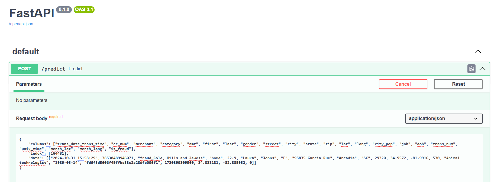
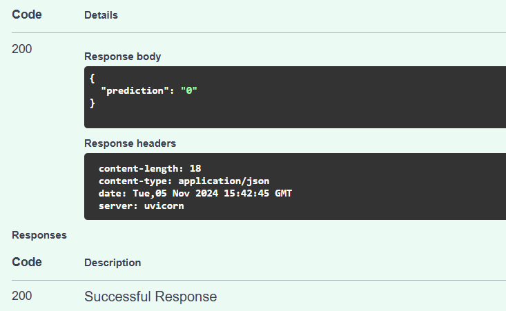
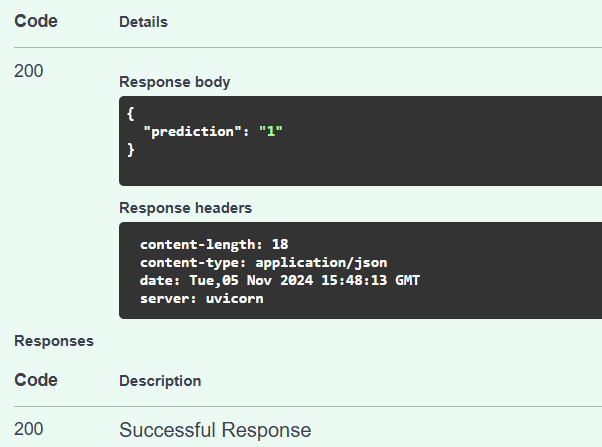
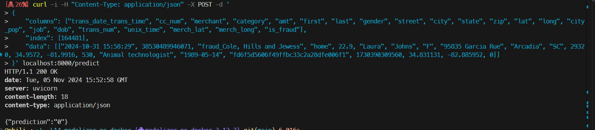

# Local test (WIN11)

```powershell
conda create --name modelizer_no_docker python=3.12 -y
conda activate modelizer_no_docker
code .
```

* In your Python environment you may have to install 
    * uvicorn
    * fastapi 
    * pydantic

```powershell
conda install uvicorn, pydantic, fastapi -c conda-forge -y
conda install mlflow -c conda-forge -y
conda install boto3 -c conda-forge -y
conda install imbalanced-learn -c conda-forge -y

```
<!-- modifier secrets.ps1 -->

1. Open modelizer.py
1. F5
1. Browse http://localhost:8000/docs#/default/predict_predict_post
1. Paste this
```powershell
{
    "columns": ["trans_date_trans_time", "cc_num", "merchant", "category", "amt", "first", "last", "gender", "street", "city", "state", "zip", "lat", "long", "city_pop", "job", "dob", "trans_num", "unix_time", "merch_lat", "merch_long", "is_fraud"],
    "index": [164481],
    "data": [["2024-10-31 15:58:29", 38530489946071, "fraud_Cole, Hills and Jewess", "home", 22.9, "Laura", "Johns", "F", "95835 Garcia Rue", "Arcadia", "SC", 29320, 34.9572, -81.9916, 530, "Animal technologist", "1989-05-14", "fd6f5d5606f49ffbc33c2a28dfe006f1", 1730390309560, 34.831131, -82.885952, 0]]
}
```

<p align="center">

<p>

5. You should see 

<p align="center">

<p>

6. While if you paste this 

```powershell
{
    "columns": ["trans_date_trans_time", "cc_num", "merchant", "category", "amt", "first", "last", "gender", "street", "city", "state", "zip", "lat", "long", "city_pop", "job", "dob", "trans_num", "unix_time", "merch_lat", "merch_long", "is_fraud"],
    "index": [1781],
    "data": [["2020-06-21 22:37", 6564459919350820, "fraud_Nienow PLC", "entertainment", 620.33, "Douglas", "Willis", "M", "619 Jeremy Garden Apt. 681", "Benton", "WI", 53803, 42.5545, -90.3508, 1306, "Public relations officer", "1958-09-10", "47a9987ae81d99f7832a54b29a77bf4b", 1371854247, 42.771834, -90.158365, 1]]
}
```

7. You see a fraud

<p align="center">

<p>


8. If you want to do some testing with curl commands try this : 

```powershell
curl -i -H "Content-Type: application/json" -X POST -d '
{ 
    "columns": ["trans_date_trans_time", "cc_num", "merchant", "category", "amt", "first", "last", "gender", "street", "city", "state", "zip", "lat", "long", "city_pop", "job", "dob", "trans_num", "unix_time", "merch_lat", "merch_long", "is_fraud"],
    "index": [164481],
    "data": [["2024-10-31 15:58:29", 38530489946071, "fraud_Cole, Hills and Jewess", "home", 22.9, "Laura", "Johns", "F", "95835 Garcia Rue", "Arcadia", "SC", 29320, 34.9572, -81.9916, 530, "Animal technologist", "1989-05-14", "fd6f5d5606f49ffbc33c2a28dfe006f1", 1730390309560, 34.831131, -82.885952, 0]]    
}' localhost:8000/predict
```

<p align="center">

<p>


