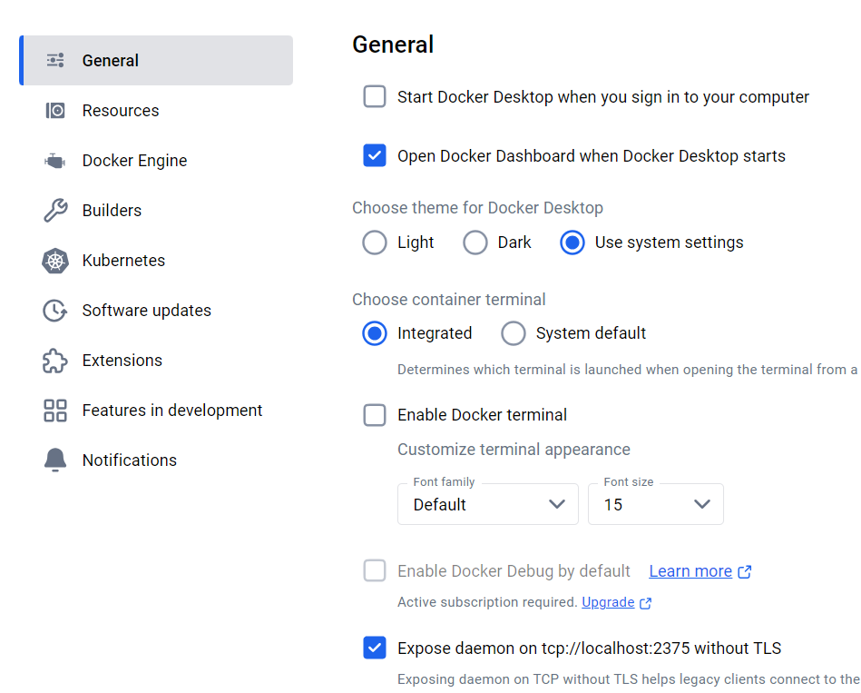
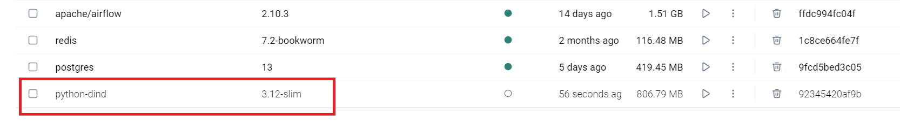
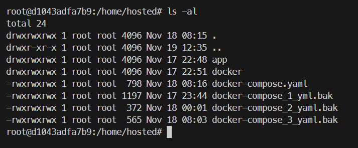
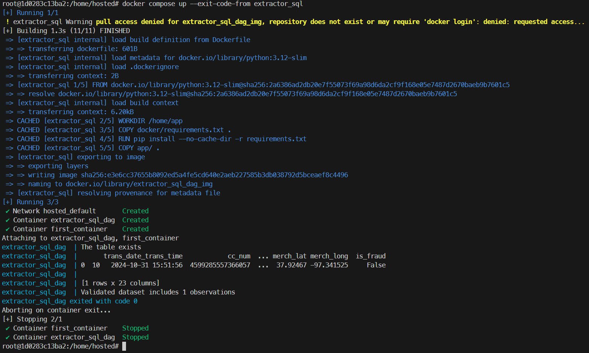
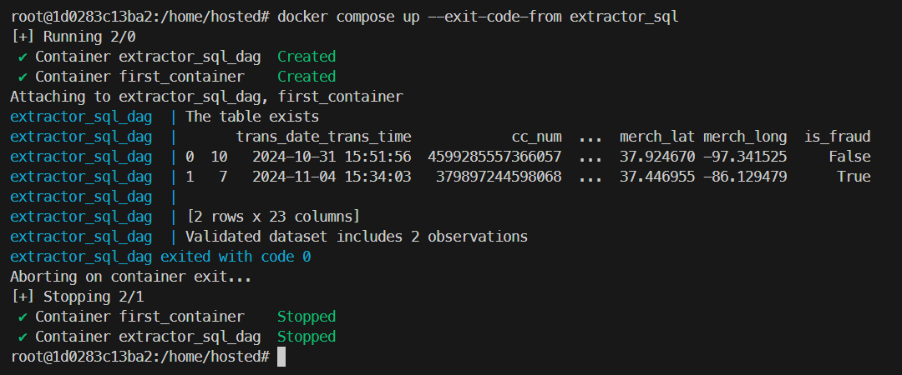
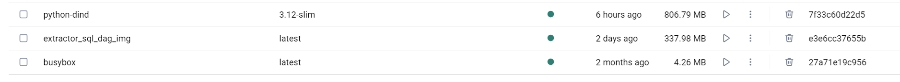
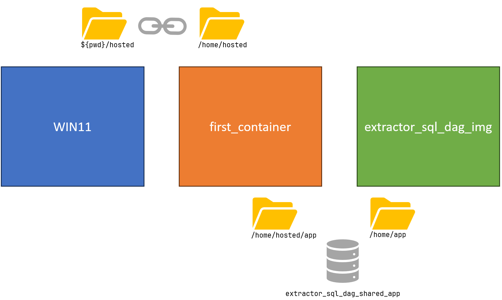

<!-- 

# Can be useful in pgAdmin
# select count(*) FROM fraud_detection_2_table;
# select count(*) FROM fraud_detection_2_table where fraud_confirmed is null;
# select count(*) FROM fraud_detection_2_table where fraud_confirmed is not null;
# UPDATE fraud_detection_2_table SET fraud_confirmed = NULL; 


docker compose up --exit-code-from extractor_sql
-->


<!-- ###################################################################### -->
<!-- ###################################################################### -->
<!-- ###################################################################### -->
# Objective
I am developing on WIN11. For the project `fraud_detection_2`, I want to use Airflow and its DAGs. In my case, these DAGs involve containers executing various project modules.  
Yes, this means we will run containers within the Airflow container. This approach is called Docker In Docker (DinD). Each module runs in its own container, which is convenient since each module was designed to function only in a container. By "module," I mean, for example: `extractor_sql`, `logger_sql`...

<!-- ###################################################################### -->
<!-- ###################################################################### -->
## Why containers in DAGs?
If a DAG is Python code that uses specific libraries, these libraries need to be installed in the container where Airflow is running.  
If tomorrow some modules require PyTorch, TensorFlow, Pandas... All these libraries must be available in the Airflow container. This approach can quickly lead to versioning and compatibility issues (virtual environments exist for a reason). 

Moreover, running code in containers within DAGs ensures clear separation of responsibilities:  
- Airflow orchestrates DAGs.  
- It neither manages nor is affected by what runs within these DAGs.  

Code executed within a container in a DAG is pre-tested and validated.  It includes the libraries it needs and is unaware that it is running in a DAG. It simply performs its task as usual.

<!-- ###################################################################### -->
<!-- ###################################################################### -->
## Limitations and advantages of DinD
Below are common arguments and counterarguments regarding DinD.

<!-- ###################################################################### -->
### Limitations
* **Complexity**: Adds an additional abstraction layer, which can complicate debugging. I agree.  
* **Performance impact**: Containers running inside a DinD environment are nested, potentially causing resource overhead. Not really a problem—just add more CPUs.  
* **Security**: Containers in a DinD environment **share the parent container's kernel**, which can lead to security issues if isolation is poorly managed.  
* **Volumes and networks**: Managing volumes and networks between DinD layers can be tedious. Yes, it’s a pain if you’re not organized.

<!-- ###################################################################### -->
### Advantages
* **Isolation**: Ensures complete separation between the Docker environment within the container and the host's Docker engine. This is precisely what I need.  
* **Portability**: Configurations can be packaged into an image, making them easy to transport and share. This is part of the requirements since there's no guarantee that modules will always be tested and executed in their original environment.  
* **Ease of CI/CD pipeline configuration**: Eliminates reliance on an external Docker daemon. Everything is encapsulated within a container.  
* **Flexibility**: Enables running different Docker versions in different containers.

<!-- ###################################################################### -->
<!-- ###################################################################### -->
## Why conduct these tests?
I am facing significant issues with Airflow, particularly concerning:  
1. Passing environment variables (e.g., credentials) from the WIN11 host system to the Airflow container and from the Airflow container to the container running the module.  
2. Volume mapping between the WIN11 host system and the Airflow container and between the Airflow container and the container running the module.

<!-- ###################################################################### -->
<!-- ###################################################################### -->
## What is the plan?
- To isolate the issues, I will exclude Airflow for now.  
- I will use a thoroughly tested module (`extractor_sql`) that retrieves records from a PostgreSQL database hosted on Heroku and saves them as `.csv` files in an AWS S3 bucket.  
- This module requires credentials to connect to Heroku and AWS.  
- Building the module involves invoking `docker compose` from the module's root directory.  
- Since the method and module work reliably, any issues will not originate here.


<!-- ###################################################################### -->
### The plan
1. Build an image capable of DinD.  
2. Instantiate a container from this image and connect to it.  
3. Inside the container, build the image required to run the module. Normally, the command line remains unchanged.  
4. From the second image, instantiate a container and execute the module. Again, this should not change the usual process.  
5. The container should start, execute the module, and produce a new `.csv` file in the S3 bucket. The second container should then shut down.


<!-- ###################################################################### -->
<!-- ###################################################################### -->
<!-- ###################################################################### -->
# Creating the image

* Ensure port 2375 is open in Docker.

<p align="center">

<p>

Create a Dockerfile to build an image that supports DinD.  
* Note the working directory is set at the end.  
* The content of the `./hosted` subdirectory on WIN11 is copied to `/home/hosted`.  
* The `./hosted` directory is a copy of the `extractor_sql` module directory.

```dockerfile
# Dockerfile

# Base image
FROM python:3.12-slim

# Install prerequisites and Docker
RUN apt-get update && apt-get install -y \
    apt-transport-https \
    ca-certificates \
    curl \
    gnupg \
    software-properties-common && \
    curl -fsSL https://download.docker.com/linux/debian/gpg | gpg --dearmor -o /usr/share/keyrings/docker-archive-keyring.gpg && \
    echo "deb [arch=$(dpkg --print-architecture) signed-by=/usr/share/keyrings/docker-archive-keyring.gpg] https://download.docker.com/linux/debian $(lsb_release -cs) stable" > /etc/apt/sources.list.d/docker.list && \
    apt-get update && apt-get install -y docker-ce docker-ce-cli containerd.io && \
    apt-get clean && rm -rf /var/lib/apt/lists/*

# Set environment variables for Docker in Docker
ENV DOCKER_HOST=unix:///var/run/docker.sock
ENV DOCKER_TLS_CERTDIR=""

# Set working directory
WORKDIR /home/hosted
COPY ./hosted /home/hosted

# Expose Docker socket (optional, for debugging)
EXPOSE 2375

# Default command
CMD ["/bin/bash"]
```

Create a script to build the image:

```powershell
# build_host.ps1

docker build -t python-dind:3.12-slim .
```

Run the script in a terminal. The result is a new `python-dind` image with the `3.12-slim` tag.

```powershell
./build_host.ps1
```

<p align="center">

<p>


Create a script to launch an instance of the image for the first host:  
* `--privileged` is required to allow the container to manage Docker.  
* Pay attention to the `//` before `var`.  
* This line provides access to the host's Docker daemon.  
* The second mapping shares the local `./hosted` directory with a `/home/hosted` directory inside the container.  
* Be sure to use `${pwd}` with curly braces and nothing else.  
* If issues arise, check that there are no spaces after the backticks at the end of a line.  

```powershell
# run_host.ps1

docker run -it --rm --privileged `
    -v //var/run/docker.sock:/var/run/docker.sock `
    -v ${pwd}/hosted:/home/hosted `
    python-dind:3.12-slim
```

Run an instance of the image in a container:  
* You will find yourself in the working directory specified in the Dockerfile (`/home/hosted`).  
* Note that this directory is **NOT** a copy but a mapping of the `./hosted` directory on the WIN11 host.  
* If you create a file (`touch zoubida.txt`) in the container, it will appear on WIN11 and vice versa.

```powershell
./run_host.ps1
```

<p align="center">

<p>


<!-- ###################################################################### -->
<!-- ###################################################################### -->
<!-- ###################################################################### -->
# Execute the module in its container

* Initially, you were on WIN11.  
* You started a container capable of DinD.  
* Now, you are in a directory (`/home/hosted`) containing the module files:  
    * Among others, its `docker-compose.yml`.  
    * The `app` and `docker` directories, which contain the module code and the instructions for building the image to create the containers where the application will run.  
    * Note that there is a file `./app/.env` containing the credentials to connect to AWS and the SQL database. If this file is missing (e.g., after cloning the project from GitHub), you need to recreate it.

Unlike other `README.md` files in the `fraud_detection_2` project, I will start by showing the final result before analyzing the configuration files to understand why it works. Yes, I know—it’s a teaser.

At the container prompt, enter this command:  
* Note it’s `docker compose` and not `docker-compose` (an older version and syntax no longer recommended).  
* The `--exit-code-from` option stops the container when `extractor_sql` is finished.

```bash
docker compose up --exit-code-from extractor_sql
```

<!-- ###################################################################### -->
<!-- ###################################################################### -->
## Log explanation
1. In yellow, the image `extractor_sql_dag_img` is unavailable, so it needs to be built.  
2. In blue, the image layers are built.  
3. In white, two containers, `extractor_sql_dag` and `first_container`, are created and linked.  
4. The code in `extractor_sql_dag` starts:  
    * It connects to the database and finds a table.  
    * At the end, it indicates that the validated dataset contains one record (I intentionally emptied the `validated.csv` file in the S3 bucket for testing).  
5. The code finishes.  
6. Both containers shut down.  
7. You return to the initial prompt.

Here is what I see on the screen:

<p align="center">

<p>

If you rerun the same command, the image-building process will be skipped.  
* Since the module is in `DEMO_MODE` and `DEBUG_MODE`, the module only sends one validated record at a time to the `.csv` file.  
* The file now contains two records.  
* If needed, refer to lines 26 and 29 of `./hosted/app/extractor_03.py`.

```bash
docker compose up --exit-code-from extractor_sql
```

<p align="center">

<p>


<!-- ###################################################################### -->
<!-- ###################################################################### -->
<!-- ###################################################################### -->
# Configuration explanation


<!-- ###################################################################### -->
<!-- ###################################################################### -->
## The `docker-compose` file

Let’s examine the file `./hosted/docker-compose`.

```yaml
# docker-compose 

services:

  extractor_sql:
    image: extractor_sql_dag_img
    build:
      context: .
      dockerfile: docker/Dockerfile
    container_name: extractor_sql_dag
    env_file:  
      - ./app/.env
    volumes:
      - extractor_sql_dag_shared_app:/home/app        # What is mounted : local directory
    working_dir: /home/app
    command: python extractor_03.py  
    restart: "no"                                     # Make sure the container do not restart automatically

  first_container:
    image: busybox:latest
    container_name: first_container
    volumes:
      - extractor_sql_dag_shared_app:/home/hosted/app # What is mounted : local directory
    command: tail -f /dev/null                        # keep the container active while the other container is running
    depends_on:
      - extractor_sql                                 # Ensures only that first_container starts after extractor_sql            
    restart: "no"                                     # Make sure the container do not restart automatically

volumes:
  extractor_sql_dag_shared_app:
```


<!-- ###################################################################### -->
### Section `extractor_sql:`
* The container relies on the `extractor_sql_dag_img` image.  
* If this image does not exist, it must be built following the instructions in the `build:` section.  
* **IMPORTANT**: The `context:` specifies the reference directory to use from this point forward.  
    * With `.`, it points to `/home/hosted/`, as this is the directory where the `docker compose up...` command was invoked.  
* Next, still within the `build:` section, the instructions to follow are specified in the `Dockerfile` located in `./docker` (this will be detailed in a moment).  
* Once the image is built, the container will be named `extractor_sql_dag`.  
    * Keep in mind that this container will eventually be part of an Airflow DAG.  
* The `env_file:` section specifies that environment variables need to be retrieved and passed to the container.  
    * The directory pointed to by `context:` is used as the reference, so the `.env` file is located in the `./app` subdirectory.  
* **VERY IMPORTANT**: The `volumes:` section specifies that the `extractor_sql_dag_shared_app` volume must be mapped to the `/home/app` directory in the container.  
    * This `volumes:` concept will be clarified shortly.  
    * For now, imagine that a "directory" named `extractor_sql_dag_shared_app` will be projected onto the `/home/app` directory.  
    * The goal is to ensure that the module code currently in `./hosted/app` on WIN11 is available there.  
* Once everything is in place, the container's working directory is defined.  
    * Think of this as running `cd /home/app`.  
* From the container's perspective, you are now in the `/home/app` directory, and since Python is in the path, running the module is straightforward (`python extractor_03.py`).  
* Finally, it is specified that the container will not restart automatically in case of an issue. While this is usually the default behavior, it doesn't hurt to explicitly state the expected behavior.  


<!-- ###################################################################### -->
### Section `first_container:`
Split into two parts:

#### Easy part
* This includes all the lines except the `volumes:` section.  
* Nothing unexpected here.  
* In the second-to-last line, the `depends_on:` section ensures that the containers start in the correct order.  
* The `tail -f /dev/null` command is simply used to keep the `first_container` running. Don't worry, it consumes very little processing power. Additionally, it’s a short-lived process that allows the `first_container` to stop when the container it depends on (`extractor_sql`) stops. We'll revisit this in the "Complex part."  
* The reason for using a `busybox` image instead of another one is simply its small size.  

<p align="center">

<p>


#### The complex part...
* This is where the `volumes:` section comes into play.  
* I find this method a bit unusual, but it works.  
* **The first thing** to understand is that Docker does not "chain" volumes between containers by default. Therefore, just because the `./hosted` subdirectory on WIN11 is mapped to the local directory `/home/hosted` doesn’t mean it will also be mapped or even mappable (I’m not entirely sure, but I think I encountered issues with this before).  
    * Refer to the `-v ${pwd}/hosted:/home/hosted` in the `docker run...` command in `run_host.ps1`.  
* As is often the case with IT issues, **the solution involves adding another layer of indirection**.  
* Here, this is achieved by creating a named Docker volume (`extractor_sql_dag_shared_app`).  
    * The name is intentionally long to avoid confusion with other volumes.  
    * To simplify, think of this as a shared disk that both `first_container` and `extractor_sql_dag` can access.  
* Therefore, if the `first_container` maps the contents of `/home/hosted/app` to `extractor_sql_dag_shared_app`:  
    * `extractor_sql_dag_shared_app` should contain the content of `./hosted` on WIN11, because the first container was launched with the option `${pwd}/hosted:/home/hosted`.  
* Finally, if `extractor_sql_dag` maps `/home/app` to `extractor_sql_dag_shared_app`:  
    * By extension, `/home/app` should contain the content of `./hosted` from WIN11.  
* This explains the following lines:  
    1. `- extractor_sql_dag_shared_app:/home/app`  
    1. `- extractor_sql_dag_shared_app:/home/hosted/app`  
    1. `extractor_sql_dag_shared_app:`  
* The last line ensures that the named volume is created if it doesn’t already exist.

The diagram below illustrates how the content of `WIN11/hosted/app` ends up in `extractor_sql_dag/home/app`. Essentially, `first_container` receives all the content from `WIN11/hosted` but shares only a subset (`WIN11/hosted/app`) with `extractor_sql_dag`. This way, `extractor_sql_dag` has access to the `.py` and `.env` files.  


<p align="center">

<p>


Well, that's it; we understand everything, it's done. **Or is it...?**

* **The second thing** to understand is that even though we are talking about Docker in Docker, Docker is designed to run applications or processes as services in containers. If no process remains active, the container stops.  
* Here, even though the `extractor_sql_dag` container depends on the shared volume with the `first_container`, this does not keep `first_container` active.  
* Docker does not consider volume sharing a "process" that prevents the `first_container` from stopping.  
* This explains the `command: tail -f /dev/null` line. It keeps the first container running, ensuring it continues to map the named volume so that the second container can access the credentials (`.env`) and the module source code (`extractor_03.py`).  

To summarize, and this is why I find this solution curious, here’s the sequence of events:  
1. I am on WIN11:  
    * I have a subdirectory `./hosted` containing a subdirectory `./app` with the module code to run.  
2. I launch a container:  
    * It maps the Windows directory `./hosted` (the source) to its local directory `/home/hosted` (the target).  
3. From the Linux prompt, using `docker compose up`, I launch two containers:  
    1. `first_container`: maps the volume `extractor_sql_dag_shared_app` to its local directory `/home/hosted/app`.  
    2. `extractor_sql_dag`: maps the volume `extractor_sql_dag_shared_app` to its local directory `/home/app` (the target).  
4. Since the mapping performed by `first_container` lasts only as long as `first_container` is running, we keep it busy by having it send logs from `/dev/null`. It feels a bit like Shadoks' logic.


##### Note
For those curious... In the comments of this `README.md`, at this point in the document, I left a `TODO`. The idea is to explore whether it’s possible to simplify things further by using two `docker-compose.yaml` files or similar. I tried twice and then returned to writing this document. I don’t have the time to investigate further, but I believe there’s potential to refine the solution and eliminate the need for the `first_container` service.  


<!-- 
## TODO
* Faire un test avec un truc où on utilise 2 docker-compose et où dans le premier on créé extractor_sql_dag_shared_app_2
* On lance le 1er conteneur avec un docker compose car il permet de créer un volume nommé
    * docker compose run dind_service

```yaml
# docker-compose

services:
  dind_service:
    image: python-dind:3.12-slim
    container_name: dind_service
    volumes:
      - /var/run/docker.sock:/var/run/docker.sock
      - extractor_sql_dag_shared_app_2:/home/hosted
    privileged: true
    command: /bin/sh
    stdin_open: true
    tty: true                           # désactive le mode de détachement 

volumes:
  extractor_sql_dag_shared_app_2:
```

* Ensuite pour le second conteneur 
* Faire un nouveau docker-compose où on vire toute la section ``first_container:`` 


```yaml
# docker-compose 

services:
  
  extractor_sql:
    image: extractor_sql_dag_img
    build:
      context: .
      dockerfile: docker/Dockerfile
    container_name: extractor_sql_dag
    env_file:  
      - ./app/.env
    volumes:
      - extractor_sql_dag_shared_app:/home/app
    working_dir: /home/app
    command: python extractor_03.py  
    restart: "no"                   # Make sure the container do not restart automatically

volumes:
  extractor_sql_dag_shared_app:
```

 -->


<!-- ###################################################################### -->
<!-- ###################################################################### -->
## The `Dockerfile`

File: `./hosted/docker/Dockerfile`

```dockerfile
# Dockerfile

FROM python:3.12-slim

# Define the working directory inside the Docker container
WORKDIR /home/app

# Install requirements
COPY docker/requirements.txt .
RUN pip install --no-cache-dir -r requirements.txt    

# Copy the application code to the current directory
COPY app/ .
```

There's really nothing special to say; it's as straightforward as it gets.

<!-- ###################################################################### -->
### The `requirements.txt` file

File: `./hosted/docker/requirements.txt`

```python
# requirements. txt

psycopg2-binary
sqlalchemy
pandas
fsspec              # for pandas to write/read s3://fraud-detection-2-bucket
s3fs                # for pandas to write/read s3://fraud-detection-2-bucket
```


Here too, no changes. It's just a list of the modules required to run extractor_03.py.
The main advantage is that this software configuration does not affect the software environment in which Airflow runs.

<!-- ###################################################################### -->
<!-- ###################################################################### -->
# Conclusion 

Chat GPT wrote most of the conclusion, I was too tired

We were able to better understand how to manage Docker containers within a container (DinD capable, Airflow). By leveraging containerized environments, we ensure isolation, flexibility, and independence from the host system and/or Airflow's dependencies. However, this approach requires careful management of volumes, dependencies, and container processes to avoid unnecessary complexity.

<!-- ###################################################################### -->
## Key Takeaways

1. **Clear Separation of Responsibilities**:  
   Each module runs in its own container, ensuring that Airflow only orchestrates DAGs and is unaffected by the execution of individual modules.

2. **Use of Named Volumes for Data Sharing**:  
   A Docker volume (`extractor_sql_dag_shared_app`) is used to bridge directories between containers (`first_container` and `extractor_sql_dag`) and between the host and containers. This approach ensures that modules have access to required resources (e.g., credentials and source code hosted on Windows 11).

3. **Keeping Containers Active**:  
   The `first_container` uses the `tail -f /dev/null` command to stay active, maintaining the volume mapping for other containers.

4. **Minimal Impact on Airflow's Environment**:  
   By encapsulating module dependencies (e.g., libraries like Pandas or SQLAlchemy) in their own Docker images, you prevent versioning or compatibility issues in Airflow's container.

5. **Flexibility and Portability**:  
   This method allows modules to be tested and executed independently of their original environment, supporting future portability and CI/CD pipelines.

6. **Challenges to Refine**:  
   While functional, the current setup introduces some complexity, particularly with the dependency on `first_container`. Simplifying this process, such as exploring multi-stage `docker-compose` configurations, could reduce overhead.

### Final Thoughts

This solution strikes a balance between flexibility and complexity. While the addition of DinD adds a layer of abstraction, it also provides significant advantages in modularity, isolation, and maintainability. Moving forward, refining the process and reducing dependencies between containers could further enhance the workflow's efficiency and simplicity.


<!-- ###################################################################### -->
<!-- ###################################################################### -->
# What's next?
* Go to the directory `./08_airflow` and read the [README.md](../../08_airflow/README.md) file.  
* The link may not work on GitHub but works locally in VSCode or in a web browser.  
* [Try this](https://github.com/40tude/fraud_detection_2/tree/main/08_airflow).


