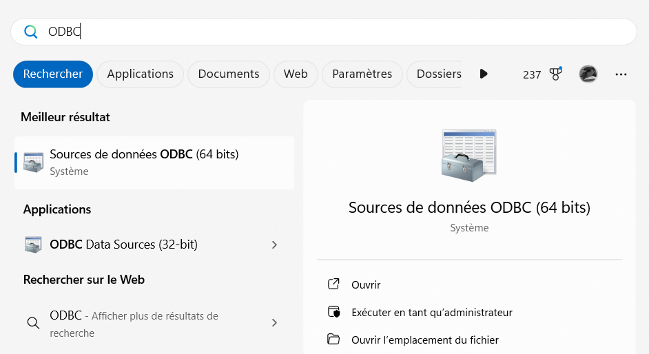
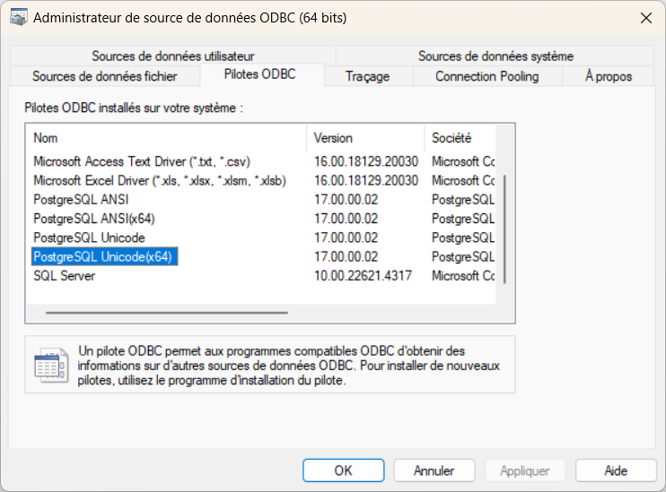
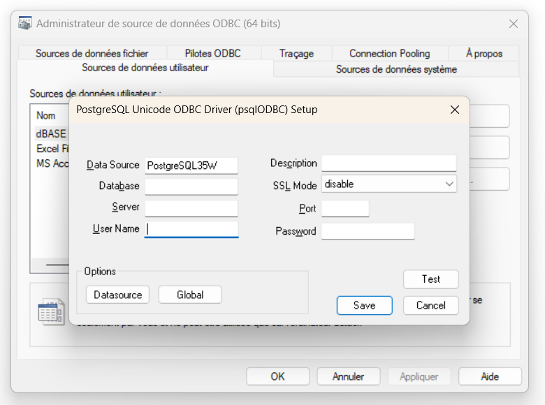
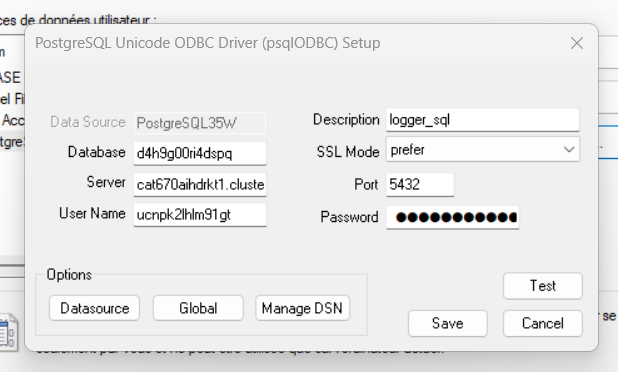
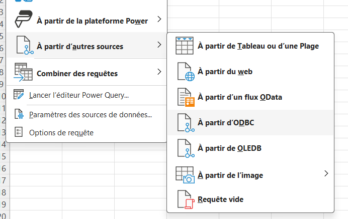
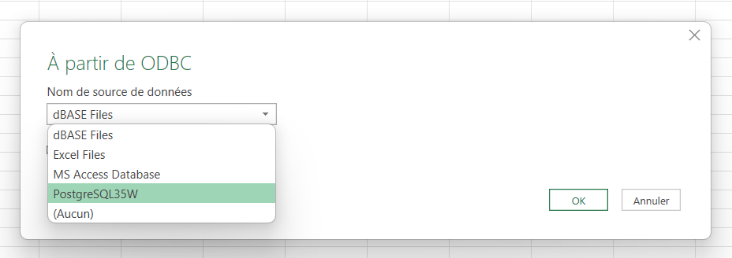
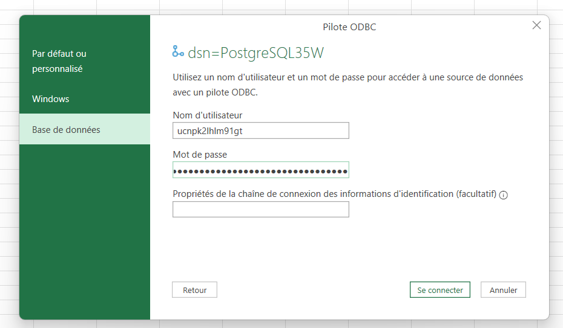
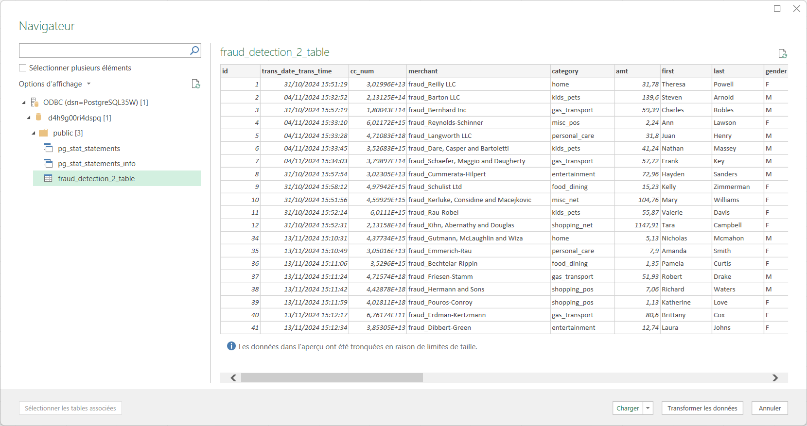
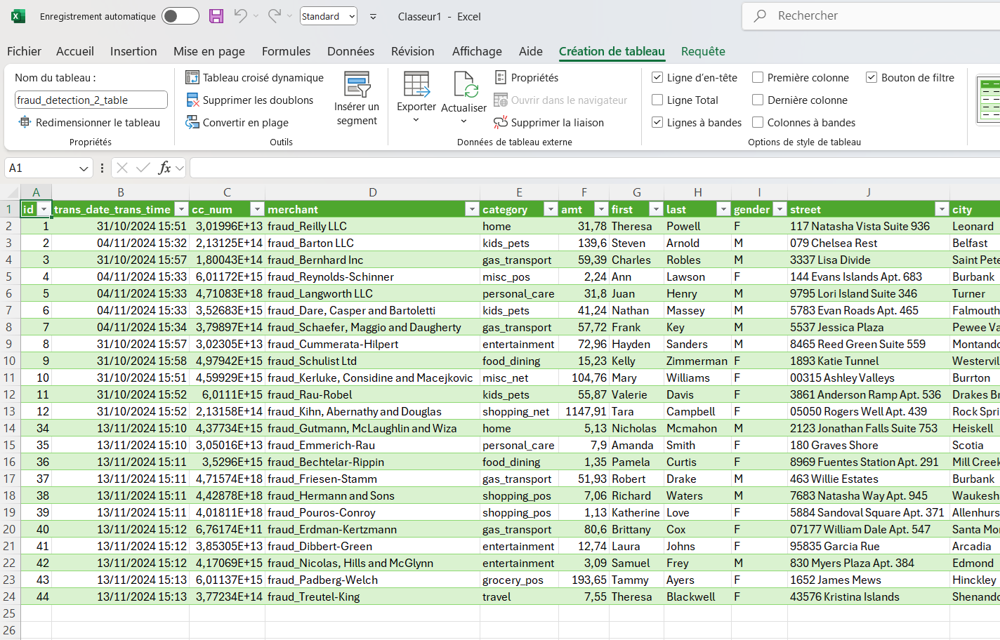

# Install ODBC driver under Windows 11 to access from Heroku with Excel

* Get the ODBC driver from here
    * https://www.postgresql.org/ftp/odbc/releases/REL-17_00_0002-mimalloc/
    * Install

* WIN + type in "ODBC"
* Select 64 bits

* Check the ODBC drivers tab
* Check if it is available

* If available
* Select User Data Source
* Add

* Enter credential, URL...
* **SSL** Select prefer

* Open Excel
* Data / Get Data /Other sources /ODBC

* Select the source

* Again fill user and password

* Click load

* Congrats 😁

