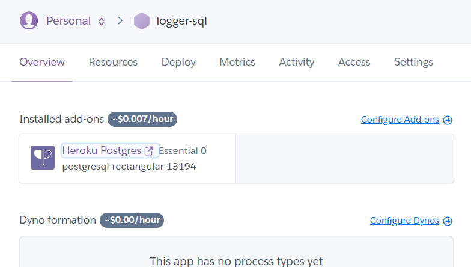
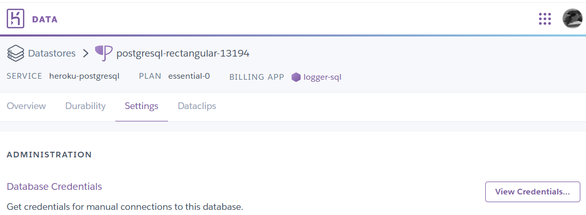
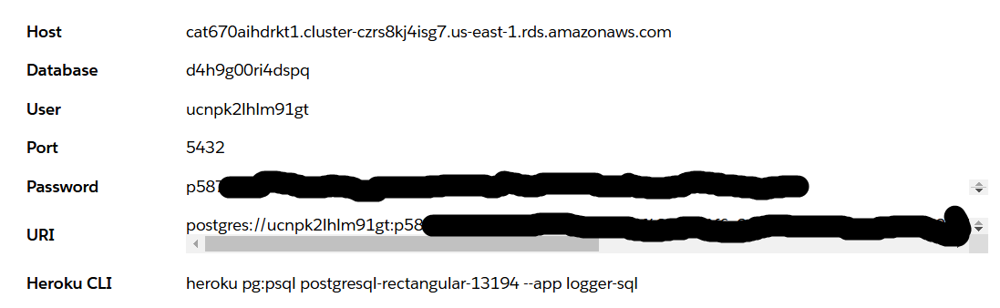
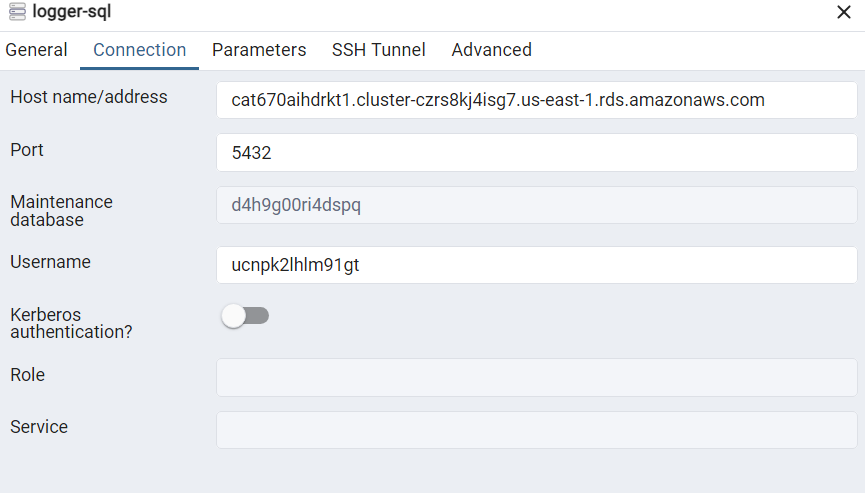
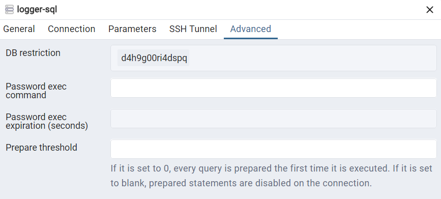
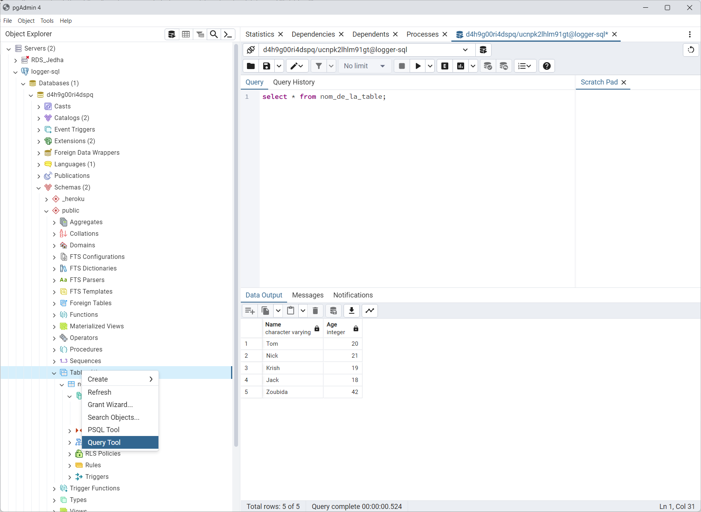

<!-- 

# Can be useful in pgAdmin
# select count(*) FROM fraud_detection_2_table;
# select count(*) FROM fraud_detection_2_table where fraud_confirmed is null;
# select count(*) FROM fraud_detection_2_table where fraud_confirmed is not null;
# UPDATE fraud_detection_2_table SET fraud_confirmed = NULL; 

-->


<!-- ###################################################################### -->
<!-- ###################################################################### -->

# *****  Still under construction *****


# Logger_SQL 

```powershell
conda create --name logger_sql python=3.12 -y
conda activate logger_sql
conda install pandas  -c conda-forge -y

heroku login
heroku create logger-sql 
heroku addons:create heroku-postgresql:essential-0 --app logger-sql
```


Sur heroku.com sur la page de l'application
<p align="center">

<p>

Cliquer sur Heroku PostgreSQL

<p align="center">

<p>

lick on Settings 
View credentials.
<p align="center">

<p>

Copy the URI link : postgres://ucn...
Add "ql" to "postgres://…"  => postgresql://ucn...
Save it into the ./secrets.ps1

```powershell
$env:LOGGER_SQL_URI = "postgresql://ucn..."
```


```powershell
conda install psycopg2-binary -c conda-forge -y
conda install sqlalchemy -c conda-forge -y
```

<p align="center">

<p>

<p align="center">

<p>

<p align="center">

<p>


<!-- ###################################################################### -->
<!-- ###################################################################### -->
# What's next ?
* Go to the directory `./03_logger_sql_testable` and read the [README.md](../03_logger_sql_testable/README.md) file 
    * The previous link (``README.md``) may not work on GitHub but it works like a charm locally in VSCode or in a Web browser
    * [Try this](https://github.com/40tude/fraud_detection_2/tree/main/02_business/01_application_ops/03_logger_sql_testable)


