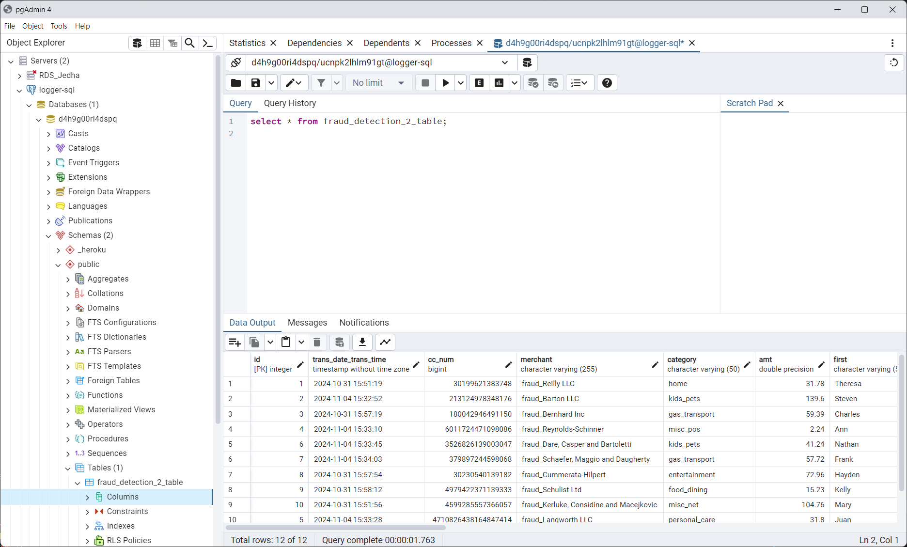

<!-- 
docker exec -it jenkins-blueocean /bin/bash
cd /var/jenkins_home/workspace/fraud_detection_2_tests
-->

<!-- 
cd C:\Users\phili\OneDrive\Documents\Programmation\Formations_JEDHA\04_Data_Science_Lead2_oct_2024\07_MLOps\02_CICD\sample-jenkins-server
docker-compose up
-->


<!-- 

# Can be useful in pgAdmin
# select count(*) FROM fraud_detection_2_table;
# select count(*) FROM fraud_detection_2_table where fraud_confirmed is null;
# select count(*) FROM fraud_detection_2_table where fraud_confirmed is not null;
# UPDATE fraud_detection_2_table SET fraud_confirmed = NULL; 

-->


<!-- ###################################################################### -->
<!-- ###################################################################### -->
# Introduction

* Define the steps to follow in order to :
    1. On any module of the ``fraud_detection_2`` project
    1. Add testing 
    1. Then automate the testing with Jenkins when the project is pushed on GitHub
* Concepts and technical issues have been already covered. See theses 2 mini projects :  
    * 99_tooling\20_testing
    * 99_tooling\24_Jenkins_Testing
* The point is to take an already working module of the ``fraud_detection_2`` project and add automated testing capabilities
* We'll be working with ``05_logger_sql`` on the understanding that the method would be the same for another module.


<!-- ###################################################################### -->
<!-- ###################################################################### -->

# 1. Check the module runs as expected

* The point is to make sure issues don't come from the code

* Check the database on Heroku
<p align="center">

<p>

* In VSCode
* Make a copy of ``05_logger_sql``, name it ``05_logger_sql_testable`` 
* Make sure the module is working
* We will make sure only 3 records are added to the SQL database
    * Otherwise the module runs in an inifinite loop and this in not what we want now
    * Open ``./app/04_logger04.py`` at the top of the code set `k_Max_Loop` to the number of records to be stored before the modules stops

```python
# For debug & testing  only
# Set k_Max_Loop to -1 otherwise
k_Max_Loop = 3
```
* Save the file
* Open an integrated terminal in ``05_logger_sql_testable``
* ``./run_app.ps1``
    * 3 records should be added to the SQL database
    * Make sure ``topic_2`` in not empty

<p align="center">

<p>


<!-- ###################################################################### -->
<!-- ###################################################################### -->
# 2. Check the module can be tested

* In 6 steps


<!-- ###################################################################### -->
## 1. Setup 

1. Delete ``./build_img.ps1``
1. Create an empty ``__init__.py`` file in ``./app``
1. Create a `05_logger_sql_testable/tests` directory  
    1. Create an empty ``__init__.py`` file in ``./tests``
    1. Create a `./tests/test_logger_04.py` file

```python
# test_logger_04.py

import pytest

# -----------------------------------------------------------------------------
def test_dummy() -> None:
    assert True

```


<!-- ###################################################################### -->
## 2. Modify ``./docker-compose.yml`` from 

```yaml
services:
  logger_sql:
    image: logger_sql_img
    build: /docker
    container_name: logger_sql
    environment:
      - SASL_USERNAME=${SASL_USERNAME}
      - SASL_PASSWORD=${SASL_PASSWORD}
      - LOGGER_SQL_URI=${LOGGER_SQL_URI}
    volumes:
      - ./app:/home/app              
    working_dir: /home/app
    command: python logger_04.py
```


to that


```yaml
# docker-compose.yml

services:
  logger_sql:
    image: logger_sql_img
    build:
      # determine the working directory on the host
      context: .
      dockerfile: docker/Dockerfile
    container_name: logger_sql
    environment:
      SASL_USERNAME: ${SASL_USERNAME}
      SASL_PASSWORD: ${SASL_PASSWORD}
      LOGGER_SQL_URI: ${LOGGER_SQL_URI}
    volumes:
      - ./app:/home/app
    # specifies the default working directory in the container at the time of service execution
    # ie independently of the WORKDIR directive defined in the Dockerfile
    working_dir: /home/app
    command: python logger_04.py

  logger_sql_test:
    image: logger_sql_img_test
    build:
      context: .
      dockerfile: docker/Dockerfile
      args:
        REQUIREMENTS_4TESTS: requirements_4tests.txt
    container_name: logger_sql_test
    environment:
      PYTHONPATH: /home/app  
    volumes:
      - ./app:/home/app
      - ./test_reports:/home/test_reports
    working_dir: /home
    command: pytest --junitxml=/home/test_reports/pytest_report.xml --html=/home/test_reports/pytest_report.html

```

* Pay **ATTENTION**. Above in the environment section the line 
    * `- SASL_USERNAME=${SASL_USERNAME}` 
    * is now `SASL_USERNAME: ${SASL_USERNAME}`
    * Don't ask me why. 
    * What was working yesterday no longer work today... 
    * The error message was weird for me (`services.logger_sql.environment must be a mapping`)
    * I guess it is all about the fact that some section are ``list`` (`volumes`) while others are ``dictionaries`` (`environment`) 


<!-- ###################################################################### -->
## 3. Create a ``./docker/requirements_4tests.txt`` file

```python
# requirements_4tests.txt

pytest
pytest-html

```


<!-- ###################################################################### -->
## 4. Modify `./docker/Dockerfile` from this

```dockerfile
FROM python:3.12-slim

WORKDIR /home/app

RUN apt-get update

RUN apt-get update && \
    apt-get install -y --no-install-recommends unzip curl librdkafka-dev && \
    rm -rf /var/lib/apt/lists/* 

COPY docker/requirements.txt .
RUN pip install --no-cache-dir -r requirements.txt    

COPY app/ .
```


to that


```dockerfile
# Dockerfile

FROM python:3.12-slim
ARG REQUIREMENTS_4TESTS

# defines the current working directory for all subsequent instructions in the 
# Dockerfile, as well as for the execution of commands in the resulting container
WORKDIR /home

RUN apt-get update

RUN apt-get update && \
    apt-get install -y --no-install-recommends unzip curl librdkafka-dev && \
    rm -rf /var/lib/apt/lists/* 

COPY docker/requirements.txt .
RUN pip install --no-cache-dir -r requirements.txt    

# Execute pip install iff REQUIREMENTS_4TESTS is defined
# Z!!!!! the cp command does NOT refer to the host's docker/ directory
# Instead, it expects this directory to already be present in the IMAGE, which is not the case without a COPY.
COPY docker/${REQUIREMENTS_4TESTS} .
RUN if [ -n "${REQUIREMENTS_4TESTS}" ]; then \
        echo "Installing additional requirements from ${REQUIREMENTS_4TESTS}"; \
        pip install --no-cache-dir -r "${REQUIREMENTS_4TESTS}"; \
    else \
        echo "No additional requirements specified."; \
    fi

COPY app/ ./app
COPY tests/ ./tests
```


<!-- ###################################################################### -->
## 5. Modify `./run_app.ps1` from this

```powershell
. "./app/secrets.ps1"
docker-compose up -d
```

to that

```powershell
# run_app.ps1

. "./app/secrets.ps1"
docker-compose up logger_sql -d 
```


<!-- ###################################################################### -->
## 6. Create a `./test_app.ps1` 

```powershell
# test_app.ps1

. "./app/secrets.ps1"
docker-compose up logger_sql_test -d 
```


<!-- ###################################################################### -->
<!-- ###################################################################### -->
# Show time !

* Make sure to delete all previous ``logger_sql`` related containers and images
    * `./clean_logger_sql.ps1`
* Make sure to open, in VSCode, a terminal in ``./05_logger_sql_testable``


<!-- ###################################################################### -->
## Run the module

```powershell
./test_app.ps1
```


<!-- ###################################################################### -->
## Test the module

```powershell
./test_app.ps1
```

At the end, a ``./test_reports`` directory should be created and it should contains 2 versions (.xml, .html) of the test report.

<p align="center">

<p>


<!-- ###################################################################### -->
<!-- ###################################################################### -->
# 3. Serious testing of the module

* Copy, paste and rename ``test_logger_04.py`` in ``test_logger_04.py.bak``
* Copy the code below into ``test_logger_04.py`

Please not that : 
1. The fixtures mock_engine and mock_consumer use patch to mock the SQL engine and the Kafka consumer. Help to isolate and test functions without real connections
1. Tests with Mocked Dependencies include patch decorators for the functions that interact with external dependencies (to_sql, poll, etc.). Doing so, the test focuses only on verifying the logic of the function
1. Error handling tests: tests for exceptions (ValueError, KafkaException) confirm that error cases are correctly handled
1. DataFrame comparison: assert_frame_equal from pandas.testing is used to verify that DataFrames are equal in content and structure


```python
import pytest
import pandas as pd
from pandas.testing import assert_frame_equal
from typing import Generator
from confluent_kafka import Consumer
from sqlalchemy.engine import Engine
from confluent_kafka import KafkaException
from unittest.mock import patch, MagicMock
from sqlalchemy.exc import SQLAlchemyError

from app.logger_04 import (
    create_SQL_engine,
    check_table_exist,
    create_table,
    insert_observation,
    read_transaction_from_topic_2,
    topic_to_sql,
    # create_topic_consumer,
)


# -----------------------------------------------------------------------------
# Fixture to mock the SQL engine
@pytest.fixture
def mock_engine() -> Generator[MagicMock, None, None]:
    with patch("app.logger_04.create_engine") as mock_engine:
        yield mock_engine.return_value


# -----------------------------------------------------------------------------
# Fixture to mock the Kafka consumer
@pytest.fixture
def mock_consumer() -> Generator[MagicMock, None, None]:
    with patch("app.logger_04.Consumer") as mock_consumer:
        yield mock_consumer.return_value


# -----------------------------------------------------------------------------
# Test to check if `check_table_exist` correctly detects existing or non-existing tables
def test_check_table_exist(mock_engine: MagicMock) -> None:
    # Mocking the inspector to simulate SQLAlchemy's table inspection behavior
    with patch("app.logger_04.inspect") as mock_inspect:
        mock_inspector = MagicMock()
        mock_inspect.return_value = mock_inspector
        mock_inspector.has_table.return_value = True

        # Call the function and assert that it detects the table existence
        assert check_table_exist(mock_engine, "test_table") is True


# -----------------------------------------------------------------------------
# Test to verify that the SQL table is created without errors
def test_create_table(mock_engine: MagicMock) -> None:
    # Mocking the connection for table creation
    mock_conn = mock_engine.connect.return_value.__enter__.return_value
    create_table(mock_engine)
    # Verify that `execute` and `commit` were called for table creation
    mock_conn.execute.assert_called_once()
    mock_conn.commit.assert_called_once()


# -----------------------------------------------------------------------------
# Test inserting a single observation (row) into the SQL table
def test_insert_observation(mock_engine: MagicMock) -> None:
    # Mocking the DataFrame and SQL connection transaction
    test_df = pd.DataFrame({"id": [1], "is_fraud": [True]})
    mock_conn = mock_engine.begin.return_value.__enter__.return_value

    # Test the insertion function
    with patch.object(test_df, "to_sql") as mock_to_sql:
        insert_observation(mock_engine, test_df, "test_table")
        # Verify `to_sql` was called with the transaction connection
        mock_to_sql.assert_called_once_with("test_table", mock_conn, if_exists="append", index=False)


# -----------------------------------------------------------------------------
# Test if ValueError is raised for a DataFrame with more than one row
def test_insert_observation_invalid_df(mock_engine: MagicMock) -> None:
    with pytest.raises(ValueError):
        insert_observation(mock_engine, pd.DataFrame({"id": [1, 2]}), "test_table")


# -----------------------------------------------------------------------------
# Test reading a valid Kafka message and converting it to a DataFrame
def test_read_transaction_from_topic_2_valid_message(mock_consumer: MagicMock) -> None:
    # Mocking a valid Kafka message with a value and no error
    mock_message = MagicMock()
    mock_message.value = lambda: b'[{"is_fraud": true, "id": 1}]'
    mock_message.error = lambda: None  # Simulate no error

    # Configure poll to return the mocked message
    mock_consumer.poll.return_value = mock_message

    # Call the function to read the message and assert DataFrame structure
    df = read_transaction_from_topic_2(mock_consumer)
    assert isinstance(df, pd.DataFrame)
    assert df.iloc[0]["is_fraud"] == True


# -----------------------------------------------------------------------------
# Test to verify that KafkaException is raised when there's a consumer error
def test_read_transaction_from_topic_2_kafka_error(mock_consumer: MagicMock) -> None:
    # Mocking a consumer error in the Kafka message
    mock_consumer.poll.return_value = MagicMock(error=lambda: KafkaException("Kafka error"))
    # Assert that KafkaException is raised during function execution
    with pytest.raises(KafkaException):
        read_transaction_from_topic_2(mock_consumer)


# -----------------------------------------------------------------------------
# Test SQL engine creation and verify table creation when it does not exist
def test_create_SQL_engine_table_creation() -> None:
    # Patch engine creation, table check, and table creation functions
    with patch("app.logger_04.create_engine") as mock_create_engine, patch(
        "app.logger_04.check_table_exist", return_value=False
    ), patch("app.logger_04.create_table") as mock_create_table:
        engine = create_SQL_engine()
        # Verify `create_table` was called if the table didn't exist
        mock_create_table.assert_called_once()


# -----------------------------------------------------------------------------
# Test data insertion from Kafka topic to SQL table
def test_topic_to_sql_data_insertion(mock_consumer: MagicMock, mock_engine: MagicMock) -> None:
    # Mocking a valid Kafka message with data and no error
    mock_message = MagicMock()
    mock_message.value = lambda: b'[{"is_fraud": true, "id": 1}]'
    mock_message.error = lambda: None  # Simulate no error

    # Configure `poll` to return the mocked message
    mock_consumer.poll.return_value = mock_message

    # Patch `insert_observation` and `time.sleep` to avoid delays
    with patch("app.logger_04.insert_observation") as mock_insert_observation, patch("time.sleep", return_value=None):

        # Call `topic_to_sql`, expecting a single iteration
        try:
            with patch(
                "app.logger_04.read_transaction_from_topic_2",
                side_effect=[pd.DataFrame([{"is_fraud": True}]), StopIteration],
            ):
                topic_to_sql(mock_consumer, mock_engine)
        except StopIteration:
            pass  # Expected to stop after one iteration

        # Verify `insert_observation` was called once with the correct DataFrame
        mock_insert_observation.assert_called_once()

        # Extract the actual DataFrame passed to `insert_observation`
        actual_df = mock_insert_observation.call_args[0][1]  # Retrieve the DataFrame argument

        # Compare the actual DataFrame with the expected DataFrame for equality
        expected_df = pd.DataFrame([{"is_fraud": True}])
        assert_frame_equal(actual_df, expected_df)
```


<!-- ###################################################################### -->
## Test the module

```powershell
./clean_logger_sql.ps1
./test_app.ps1
```

<p align="center">

<p>


<!-- ###################################################################### -->
<!-- ###################################################################### -->
# 3. Test the module if there are modifications on GitHub


<!-- ###################################################################### -->
## Before to read further

* Read this [README.md](../99_tooling/24_Jenkins_Testing/README.md)
* Indeed you must install `zip`, configure Jenkins so that it can send email etc.


<!-- ###################################################################### -->
## Once Jenkins is configured

* Rename ``./app/secrets.ps1`` as ``./app/.env``
* Make sure ``.env`` is in ``.gitignore``
* Modify its content as shown below
    * Note that the 3 variables are highly sensitive.
    * They CANNOT stay in the ``.env`` we have to create Jenkins credential
    * If one of the variables was a URL or PORT number, no problem, but in this case, there's no choice.

```python
# .env
# topic access confluent
SASL_USERNAME=6KQ...
SASL_PASSWORD=zBV...

# SQL database on Heroku
LOGGER_SQL_URI=postgresql://ucn...

```

* update the content of ``run_app.ps1`` as shown below
    * May be usefull if we want to run the module either locally on a in a container locally


```powershell
# run_app.ps1

docker-compose --env-file ./app/.env up logger_sql -d 
```


* update the content of ``test_app.ps1``

```powershell
# test_app.ps1

docker-compose --env-file ./app/.env up logger_sql -d 
```


* Open terminal (WIN X + I), run and log in Jenkins

```powershell
cd C:\Users\phili\OneDrive\Documents\Programmation\Formations_JEDHA\04_Data_Science_Lead2_oct_2024\07_MLOps\02_CICD\sample-jenkins-server
docker-compose up
```

## Create credential for the 3 passwords

Example : 

<p align="center">

<p>


## Create a Pipeline

* I name it : ``fraud_detection_2_tests``
    * At the beginning, test for the ``logger_sql`` are the only ones called but at the end all tests for all modules will get called.

* Again this is a Pipeline
* Build trigger select Poll SCM, Schedule = H/5 * * * * 
* In the script copy the code below
    * Update the directory
    * Update the email adr

```groovy
pipeline { 
    agent any

    stages {
        stage('Generate .env') {
            steps {
                dir('05_logger_sql_testable/app') {
                    withCredentials([
                        string(credentialsId: 'SASL_USERNAME', variable: 'SASL_USERNAME'),
                        string(credentialsId: 'SASL_PASSWORD', variable: 'SASL_PASSWORD'),
                        string(credentialsId: 'LOGGER_SQL_URI', variable: 'LOGGER_SQL_URI')
                    ]) {
                        writeFile file: '.env', text: """
                        FOR_THE_FUN1=Zoubida_For_Ever
                        FOR_THE_FUN2="With spaces"
                        SASL_USERNAME=$SASL_USERNAME
                        SASL_PASSWORD=$SASL_PASSWORD
                        LOGGER_SQL_URI=$LOGGER_SQL_URI
                        """
                    }
                }
            }
        }

        stage('Checkout') {
            steps {
                git branch: 'main', url: 'https://github.com/40tude/fraud_detection_2'
            }
        }

        stage('Test') {
            steps {
                dir('05_logger_sql_testable') {
                    sh 'docker-compose -f docker-compose.yml --env-file app/.env up logger_sql_test'
                }
            }
        }

        stage('Archive Reports') {
            steps {
                dir('05_logger_sql_testable') {
                    script {
                        // Define variable outside the sh block so that they are available elsewhere (see the post section)
                        env.REPORT_DIR = "./test_reports"
                        env.ARCHIVE_NAME = "test_reports_${new Date().format('yyyy-MM-dd-HHmmss')}.zip"
                        
                        // Create .zip
                        sh """
                            if [ -d "${env.REPORT_DIR}" ]; then
                                zip -r "${env.ARCHIVE_NAME}" "${env.REPORT_DIR}"
                            else
                                echo "${env.REPORT_DIR} does not exist."
                                exit 1
                            fi
                        """
                    }
                }
            }
        }
    }

    post {
        success {
            script {
                echo "Success"
                emailext(
                    subject: "Jenkins build success: ${env.JOB_NAME} #${env.BUILD_NUMBER}",
                    body: """
                    <p>Success</p>
                    <p>${env.JOB_NAME} #${env.BUILD_NUMBER}</p>
                    """,
                    to: 'xxx.yyy@gmail.com',
                    attachmentsPattern: "05_logger_sql_testable/${env.ARCHIVE_NAME}"
                )
            }
        }
        failure {
            script {
                echo "Failure"
                emailext(
                    subject: "Jenkins build failure: ${env.JOB_NAME} #${env.BUILD_NUMBER}",
                    body: """
                    <p>Failure</p>
                    <p>${env.JOB_NAME} #${env.BUILD_NUMBER}</p>
                    """,
                    to: 'xxx.yyy@gmail.com',
                    attachmentsPattern: "05_logger_sql_testable/${env.ARCHIVE_NAME}"
                )
            }
        }
    }
}

```

* What is not fun 
    * There are `dir('05_logger_sql_testable/app')` everywhere. I don't like that either. This is a kind of `cd` (change directory) for Groovy. 
    * In fact remember what we just did. Download the whole project but testing in a container is only available in ``05_logger_sql_testable``. So until now (I'm working a much more flexible option) I force the script to work only in the `05_logger_sql_testable` directory. 
    * Anyway, in the script, the idea is 
        * recreate, on fly, a ``.env`` file in the ``./app`` without compromising the passwords (they are Jenkins credentials)
        * to get the project for GitHub
        * call ``docker-compose``
        * create a zip with the content of the ``./test_reports`` directory
        * attache the zip file to an email and sent it 
* Save
* Build
* A mail has been sent 

<p align="center">

<p>

* All tests are passed

<p align="center">

<p>


<!-- ###################################################################### -->
<!-- ###################################################################### -->
# What's next ?
* If I can find some time, work on a way to discover the modules where tests are available and, if so, run them in a container.
* Go to the directory `./06_extractor_sql` and read the [README.md](../06_extractor_sql/README.md) file
* The previous link (``README.md``) may not work on GitHub but it works like a charm locally in VSCode or in a Web browser
* [Try this](https://github.com/40tude/fraud_detection_2/tree/main/06_extractor_sql)


