<!-- 
# remove all containers
docker rm -f $(docker ps -aq)
# remove image according the pattern 
docker rmi $(docker images -q "greet_img*")
-->


<!-- ###################################################################### -->
<!-- ###################################################################### -->
# 01_my_project - Smooth start

* First, read this short article : https://medium.com/@adocquin/mastering-unit-tests-in-python-with-pytest-a-comprehensive-guide-896c8c894304


```powershell
conda create --name testing_no_docker python=3.12 -y
conda activate testing_no_docker
cd fraud_detection_2\99_tooling\20_testing
code .
```

Create a my_project directory

```powershell
cd my_project
```

* Create a directory similar to the one below.
* `__init__.py` are empty files

```
│   main.py
│
├───src
│       math_utils.py
│       __init__.py
│       
└───tests
        test_math_utils.py
        __init__.py

```

```powershell

conda install pytest -c conda-forge -y
```


<!-- ###################################################################### -->
## For the mock part of the article

```powershell
conda install sqlalchemy -c conda-forge -y
conda install psycopg2-binary -c conda-forge -y

```

What if we have a database with a users table and want to create User objects from that data?

We can mock the database connection during testing to return a fake list of users to separate our tests from the database


See ``./src/user_mock.py``

Where the idea is to transform our object to an ORM model, to automatically transform the users from the database to a usable Python object.


Now we have a function that connects to a users table and fetches a list of users. 

See ``./src/user_repository.py``

With the `UserRepository` class, we will be able to transform users entries from a database to a list of User objects with the ``get_users()`` method.


To test the ``get_users()`` function without connecting to a database, you can utilize Python’s built-in ``unittest.mock.create_autospec()`` function. 

```python
session = create_autospec(Session)`
```
This allows us to create a mock object (``session``) that mimics the behavior of SQLAlchemy’s Session class


### Read the `test_user_repository.py` source code !!!
* use ``unittest.mock.create_autospec`` to create a mock object that has the same methods and attributes as SQLAlchemy's Session class.
* set up the mock object’s query and all methods to return a list containing our fake user.
* construct a UserRepository instance and replace its session with our mock session.
* call the ``get_users`` method and ensure that ``Session.query`` is called with the correct argument and that the returned list of users matches our list of fake users.
* pay attention to `from app.user_mock import User_mock`. Indeed the new version of user is named `user_mock.py` while I keep first version (``user.py``)

Run the tests : 

```powershell
pytest
```

<p align="center">
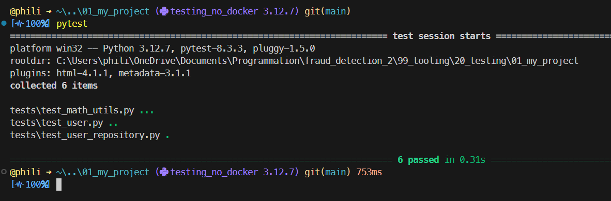
<p>


<!-- ###################################################################### -->
<!-- ###################################################################### -->
# 02_my_project

* This is where things really start. Indeed :
1. We will extend the project
    * It will create a directory
    * It will generate a .png file. The main reason is to use ``pillow`` so that both docker images (run and test) will have to have it. It would be the same if the application requires pandas, tensorflow... In any case we don't want to install pillow in our virtual environment on the host.  
    * ...
1. The project will run in a docker image
1. The tests will take place in a docker image as well

* Here, just for testing purpose, we install pillow in the virtual env. 
    * Again this is just for test. 
    * The objective is to run the app and the test in Docker images

* copy past rename ``01_my_projet`` in ``02_my_projet`` 
* rename ``src`` to ``app``
* in the ./tests directory, edit the test files
    * change ``from src.user ...``
    * to ``from app.user ...``

* move ``main.py`` to ``./app``

In the current virtual environment (``testing_no_docker``) install ``pillow``
```powershell
conda install pillow -c conda-forge -y

```


* Modify ``main.py`` such that it :
    * uses the class User
    * fetch a password from the environment
    * uses Pillow (or any module which are supposed to **NOT** be in the ``testing_no_docker`` virtual env)
    * generates an image, create a directory and save the png

* Here is the ``main.py`` I use :

```python
from user import User
from PIL import Image
from pathlib import Path
import random
import datetime
import os

if __name__ == "__main__":
    bob = User(80386, "Zoubida", 42)
    print(bob.greet())

    # my_password = os.getenv("PASSWORD", "CPE1704TKS") can't work because
    # docker-compose set PASSWORD to "null" if undefined
    my_password = os.getenv("PASSWORD")
    if my_password is None or my_password == "null" or my_password == "":
        my_password = "CPE1704TKS"
    print(f"The password is : {my_password}")

    os.chdir(Path(__file__).resolve().parent)
    Path("../img").mkdir(parents=True, exist_ok=True)
    image = Image.new("RGB", (100, 100), color=random.choice(["blue", "red", "blue", "orange", "green"]))
    timestamp = datetime.datetime.now().strftime("%Y%m%d_%H%M%S")
    image.save(f"../img/{timestamp}_dummy_artifact.png")
```
* Note how complicated can the life be just because ``docker-compose`` set undefined environment variable to "null" (I mean the string "null")
* If you run ``main.py`` in VSCode (F5), a `.png` is generated in a new ``./img`` directory, you should get a greeting from a User and discover how to stop a nuclear war.

<p align="center">
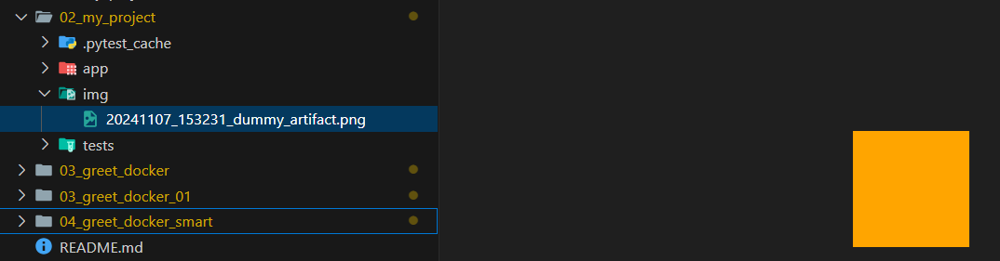
<p>


* Call `pytest` from ``./02_my_project`` 
    * Note there are no tests for ``main.py`` yet

<p align="center">
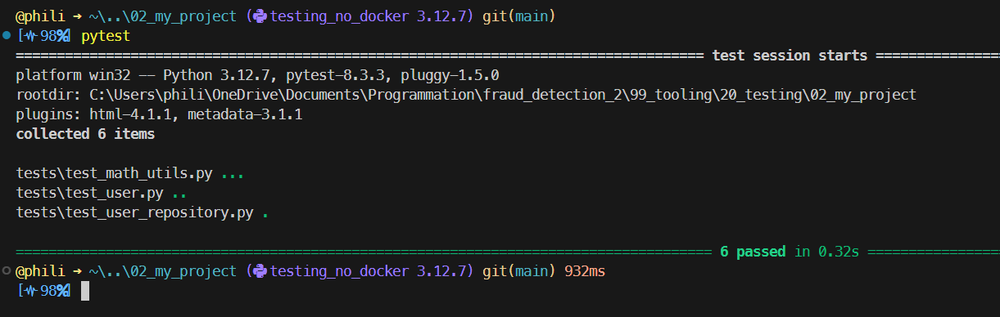
<p>

* At this point we know 
    * the app is working
    * the test are working (yes there are not yet tests for the ``main.py``)

* The next step is to run the application and to test the application in docker images without impacting the virtual environment of the host.


<!-- ###################################################################### -->
<!-- ###################################################################### -->
# 03_greet_docker

* We have the app that we wanted. For the sake of argument, let's imagine that the application uses modules that are not available in our virtual environment (think of tensorflow, for example, although here the application only uses pillow).
* We have the tests to test the application
* Now, we want to : 
    1. run the app in Docker
    1. run the tests in Docker

* Copy paste rename ``02_my_project`` in  ``03_greet_docker``


<!-- ###################################################################### -->
## Run the app in docker

* go to ``./03_greet_docker``
* Read ``./docker/requirements.txt``
    * Note that ``pillow`` will be installed
    * On the other hand `sqlalchemy` is not needed when running the ``main.py`` so it is not installed

* ``./build_img.ps1``
    * => greet_img is generated (165 MB)

* Add ``secrets.ps1`` to ``./app``

```powershell
# secrets.ps1
$env:PASSWORD  = "Zoubida_For_Ever"
```
* Make sure ``secrets`` in ``run_app.ps1`` is commented

```powershell
#. "./app/secrets.ps1"
docker-compose up -d
```

* Open docker-compose.yml

```yaml
services:
  greet:
    image: greet_img
    container_name: greet
    environment:
      - PASSWORD=${PASSWORD}
    volumes:
      - ./app:/home/app
      - ./img:/home/img
    working_dir: /home/app
    command: python main.py
```

* Note how `PASSWORD` is set if the environment variable `PASSWORD` is set
* Note that 2 volumes are created
    1. ``app``. It is where the code of the application is 
    1. ``img``. You don't have to create an `img` directory on the Windows host. It will be created by ``main.py`` and it will receive the ``.png`` files

* This is how the `./img` directory looks like after a first run.

<p align="center">
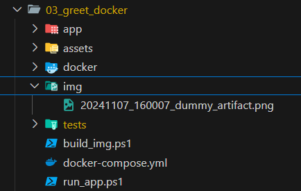
<p>


* run the app in docker : ``./run_app.ps1``
* check the outputs with docker. The default value is used.

<p align="center">
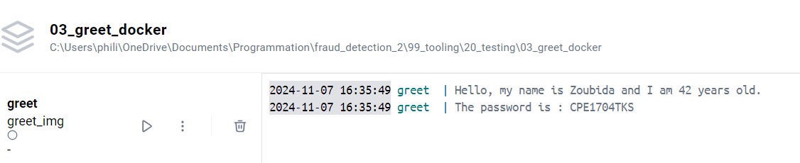
<p>

* Uncomment the line ``secrets`` in ``run_app.ps1`` is commented

```powershell
. "./app/secrets.ps1"
docker-compose up -d
```

* run once again the app in docker : ``./run_app.ps1``
* check the outputs with docker. The true value of the password is used. 

<p align="center">
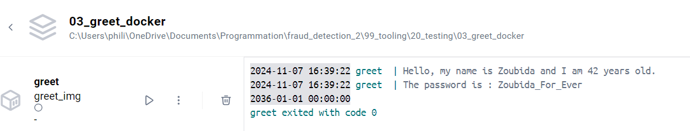
<p>


<p align="center">
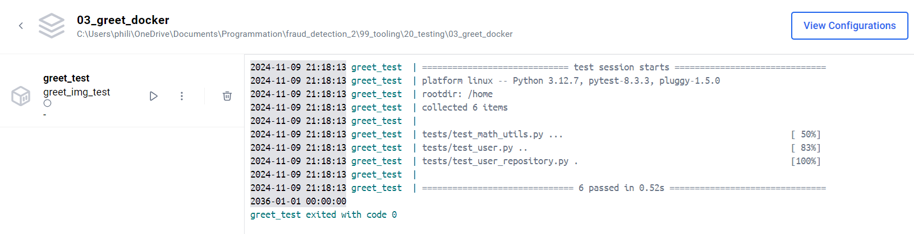
<p>


<!-- ###################################################################### -->
## Test the app in docker

* Create a ``test_app.ps1``

```powershell
# test_app.ps1

#. "./app/secrets.ps1"
docker-compose -f docker-compose-test.yml up -d
```

* Create `docker-compose-test.yml`

```yaml
# docker-compose-test.yml

services:
  greet_test:
    image: greet_img_test
    container_name: greet_test
    environment:
      - PASSWORD=${PASSWORD}
    volumes:
      - ./app:/home/app
      - ./img:/home/img

    # Specifies the default working directory in the container at the time of service execution
    # ie independently of the WORKDIR directive defined in the Dockerfile
    working_dir: /home
    command: pytest
```
* It is **important** to note that `working_dir` is now `/home` and no longer `/home/app`. 
* Why? Simply because `pytest` will be invoke from the directory above ``/app`` and `/tests`

* Create a .``/docker/Dockerfile_test``

```dockerfile
# Dockerfile_test

FROM python:3.12-slim

# defines the current working directory for all subsequent instructions in the 
# Dockerfile, as well as for the execution of commands in the resulting container
WORKDIR /home

RUN apt-get update

COPY docker/requirements_test.txt .
RUN pip install --no-cache-dir -r requirements_test.txt    

COPY app/ ./app
COPY tests/ ./tests
```
* Here it is **important** to note that in addition to ``./app`` the `./tests` directory must be copied (otherwise no tests can take place)
* Create a .``/docker/requirements_test``

```python
pytest
# pillow
psycopg2-binary
sqlalchemy
```

* ``pillow`` is **NOT** needed here since the tests do not involve ``main.py`` 
* All the other modules must be installed otherwise tests will not be possible


* Build the Docker image for test
```powershell
./build_img_test.ps1
```

* Run the tests
```powershell
./test_app.ps1
```

<p align="center">

<p>


<!-- ###################################################################### -->
<!-- ###################################################################### -->
# 03_greet_docker_01 - Can we simplify ?

* We will build the image if necessary and only use ``run_app.ps1`` or ``test_app.ps1``
* copy paste rename ``03_greet_docker`` in ``03_greet_docker_01``
* Delete ``build_img.ps1``
* Delete ``build_img_test.ps1``

## The application

* Modify `docker-compose.yml` from this :

```yaml
services:
  greet:
    image: greet_img
    container_name: greet
    environment:
      - PASSWORD=${PASSWORD}
    volumes:
      - ./app:/home/app
      - ./img:/home/img
    working_dir: /home/app
    command: python main.py
```
* To that :

```yaml
services:
  greet:
    image: greet_img
    build: 
      context: .
      dockerfile: docker/Dockerfile
    container_name: greet
    environment:
      - PASSWORD=${PASSWORD}
    volumes:
      - ./app:/home/app
      - ./img:/home/img
    working_dir: /home/app
    command: python main.py
```
* The major change is that now we tell docker-compose what to do if it don't find the image and if it need to build one
    * ``context :`` says "reference to paths start from were we are"
        * In others words : `.\03_greet_docker_01`
    * `dockerfile:` says "the recipe to follow is ``./docker/Dockerfile``

* Open Docker Desktop
    * Delete any container and image
    * Indeed we want to make the point and prove that if the image does not exist it will be created before a container is instantiated

<p align="center">
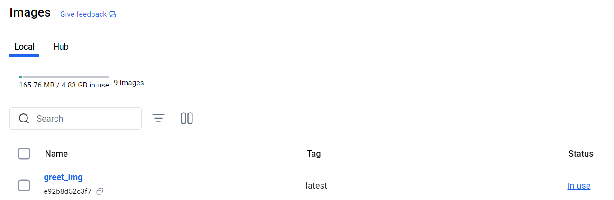
<p>

<p align="center">
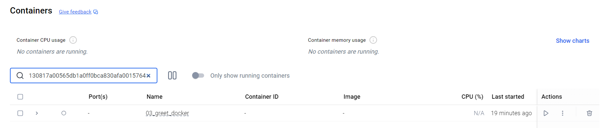
<p>


* Open a terminal in ``03_greet_docker_01``
* Run the app without building the image first

```powershell
./run_app.ps1
```
<p align="center">
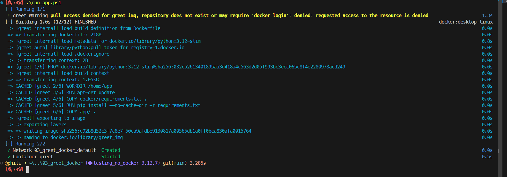
<p>

* An image has been created and a container has been executed

* Run the app again

```powershell
./run_app.ps1
```
* The image no longer need to be built before the application strats in the container 

<p align="center">
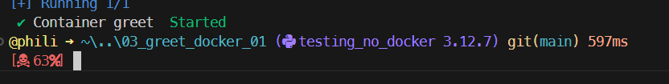
<p>

* These are the logs. Since we launched the application twice, then they are duplicated

<p align="center">
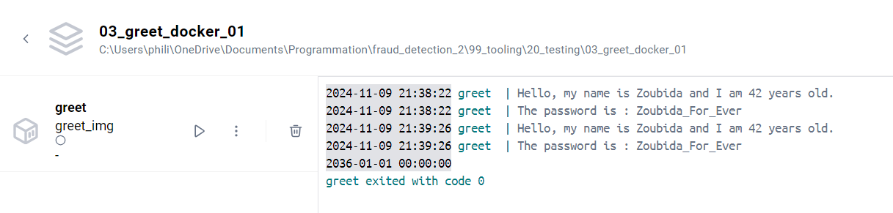
<p>


## Testing the application

* Apply similar modifications to ``docker-compose-test.yml``

```yaml
# docker-compose-test.yml

services:
  greet_test:
    image: greet_img_test
    build: 
      context: .
      dockerfile: docker/Dockerfile_test
    container_name: greet_test
    environment:
      - PASSWORD=${PASSWORD}
    volumes:
      - ./app:/home/app
      - ./img:/home/img
    
    # Specifies the default working directory in the container at the time of service execution
    # ie independently of the WORKDIR directive defined in the Dockerfile
    working_dir: /home
    command: pytest
```

* Delete any test container or test image you may have
* Run the tests directly

```powershell
./test_app.ps1
```

<p align="center">
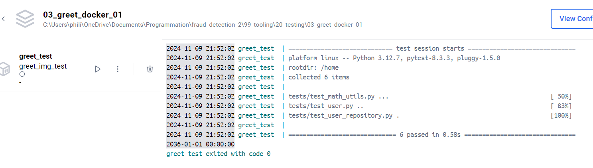
<p>

* Again an image has been created (`greet_img_test`) and a container executed (`greet_test`)

## Do you remember...
* September (EWF, 1978)
* Now, we only have 2 commands to remember :
    * `./run_app.ps1`
    * `./test_app.ps1`


<!-- ###################################################################### -->
<!-- ###################################################################### -->
# 04_greet_docker_smarter - Can we go further ?

* Copy paste rename ``03_greet_docker_01`` in ``04_greet_docker_smart``

The issue we still have is that we have :
* 2 docker-compose yaml file to maintain 
    1. ``docker-compose.yml``
    1. ``docker-compose-test.yml``
* 2 Dockerfile to maintain
    1. ``./docker/Dokerfile``
    1. `./docker/Dockerfile_test` 

* This is really error prone

* Delete or rename ``docker-compose.yml`` in ``docker-compose.yml.bak``
* Delete or rename ``docker-compose-test.yml`` in ``docker-compose-test.yml.bak``
* Delete ``./docker/Dockerfile_test``
* Create a ``docker-compose.yml``
* Copy-paste the code below

```yaml
# docker-compose.yml

services:
  greet:
    image: greet_img
    build: 
      context: .
      dockerfile: docker/Dockerfile
      args:
        REQUIREMENTS_FILE: requirements.txt
    container_name: greet
    environment:
      - PASSWORD=${PASSWORD}
    volumes:
      - ./app:/home/app
      - ./img:/home/img
    working_dir: /home/app
    command: python main.py

  greet_test:
      image: greet_img_test
      build: 
        context: .
        dockerfile: docker/Dockerfile
        args:
          REQUIREMENTS_FILE: requirements_test.txt
      container_name: greet_test
      environment:
        - PASSWORD=${PASSWORD}
      volumes:
        - ./app:/home/app
        - ./img:/home/img
      working_dir: /home
      command: pytest
```
* We can compare the new version with one of the previous versions

```yaml
# docker-compose.yml

services:
  greet:
    image: greet_img
    build: 
      context: .
      dockerfile: docker/Dockerfile
    container_name: greet
    environment:
      - PASSWORD=${PASSWORD}
    volumes:
      - ./app:/home/app
      - ./img:/home/img
    working_dir: /home/app
    command: python main.py
```
* The new version is a kind of "all in one"
* There are 2 services `greet` and `greet_test`
* Note than in the first section, `working_dir` point to `/home/app` while in the second it points to `/home` 
    * This point has been already discussed but it is important 
* **NEW**, in the ``build`` part we should notice that
    * Both sections refer to a unique `Dockerfile`
    * There is an argument named ``REQUIREMENTS_FILE`` and whose value is either ``requirements.txt`` or `requirements_test.txt`


* Open ``./docker/Dockerfile``
* Copy the code below

```dockerfile
#Dockerfile

FROM python:3.12-slim
ARG REQUIREMENTS_FILE

WORKDIR /home

RUN apt-get update

COPY docker/${REQUIREMENTS_FILE} .
RUN pip install --no-cache-dir -r ${REQUIREMENTS_FILE}    

COPY app/ ./app
COPY tests/ ./tests
```

Stay with me, the following points are all important

* **NEW**, we declare an argument `REQUIREMENTS_FILE` 
    * The declaration **MUST** happens after the `FROM` statement
    * You can set a default value but I was not able to make it work
        * ``ARG REQUIREMENTS_FILE=requirements.txt`` (no space around `=`) 
    * Whatever the case, the argument can be use as a variable named `${REQUIREMENTS_FILE}` in the rest of the file
    * When the service is `greet` in the docker-compose file then the Dockerfile installs the content of `requirements.txt`
    * When the service is `greet_test` in the docker-compose file then the Dockerfile install the content of `requirements_test.txt`
* **Update**, the `WORKDIR` is now `/home`
    * No matter if we are building an image to run the application or an image to test the application
* Since this Dockerfile is used for ``run`` and `test` version, at the end we always copy the `/app` directory **AND** the ``/tests``
    * This is mandatory for the `test` version
    * Somewhat overkill otherwise

For reference, here is one of the previous versions

```dockerfile
# Dockerfile

FROM python:3.12-slim

WORKDIR /home/app

RUN apt-get update

COPY docker/requirements.txt .
RUN pip install --no-cache-dir -r requirements.txt    

COPY app/ .
```


* Last but not least we must update the content of ``run_app.ps1`` and `test_app.ps1` so that in one case ``docker-compose.yml`` runs the application or tests the application in the other. Here are the new versions :

```powershell
# run_app.ps1

. "./app/secrets.ps1"
docker-compose up greet -d 
```

```powershell
# test_app.ps1

. "./app/secrets.ps1"
docker-compose up greet_test -d 
```
* The only difference between the two is that in one case we pass the `greet` target and `greet_test` target in the other.


## Show time !
* Make sure to delete all previous containers and images
* Make sure to open a terminal in ``./04_greet_docker_smart``
* Run the app

```powershell
./run_app.ps1
```
* Run the app again
    * As before the output in the terminal should much shorter

```powershell
./run_app.ps1
```
* Run the tests

```powershell
./test_app.ps1
```

<p align="center">

<p>

Above we can see that the application has been launched twice and the tests once


<!-- ###################################################################### -->
<!-- ###################################################################### -->
# Can we go even further ?

* Copy paste ``04_greet_docker_smart`` in ``05_greet_docker_smarter``

What is the idea here ?

* If experiences shows that the modules listed in ``requirements_test.txt`` is always equivalent to ``requirements.txt + pytest``
* Then, in Dockerfile we could always install the modules listed in ``requirements.txt``
* And install the modules listed in ``requirements_4tests.txt`` (**NEW NAME**) if and only if we are building a test configuration

In this case we can have :

```python
# requirements.txt
pillow
```

```python
# requirements_4tests.txt
pytest
psycopg2-binary
sqlalchemy
```

* Doing so, even if we need to add modules to ``requirements.txt`` the ``requirements_4tests.txt`` remains untouched. This should enable us to further reduce problems linked to file synchronization errors. 
* The reciprocity is true also. If for specific test configuration we need more modules in ``requirements_4tests.txt``, the list in ``requirements.txt`` would remains untouched.
* Finally, here's the solution I came up with :
    * **THE** most important point (I've wasted a few hours on this) is that it's absolutely essential to understand that the `cp` command does **NOT** use the host directory as its source directory. In fact, it uses a directory in the image being built as the starting directory.
    * This is **THE** reason why, whether in test mode or not, the `COPY` command copies the file (`${REQUIREMENTS_4TESTS}`) before the `if` statement.
    * Once `${REQUIREMENTS_4TESTS}` is in place (it’s only a few bytes, no need to worry), we install the modules listed in `${REQUIREMENTS_4TESTS}` only if we’re in test mode (a few MB).


```dockerfile
# Dockerfile

FROM python:3.12-slim
ARG REQUIREMENTS_4TESTS

# defines the current working directory for all subsequent instructions in the 
# Dockerfile, as well as for the execution of commands in the resulting container
WORKDIR /home

RUN apt-get update

COPY docker/requirements.txt .
RUN pip install --no-cache-dir -r requirements.txt    

# Execute pip install iff REQUIREMENTS_4TESTS is defined
# Z!!!!! the cp command does NOT refer to the host's docker/ directory
# Instead, it expects this directory to already be present in the IMAGE, which is not the case without a COPY.
COPY docker/${REQUIREMENTS_4TESTS} .
RUN if [ -n "${REQUIREMENTS_4TESTS}" ]; then \
        echo "Installing additional requirements from ${REQUIREMENTS_4TESTS}"; \
        pip install --no-cache-dir -r "${REQUIREMENTS_4TESTS}"; \
    else \
        echo "No additional requirements specified."; \
    fi

COPY app/ ./app
COPY tests/ ./tests

```


In order to test this setup we can :

```powershell
./run_app.ps1
./test_app.ps1
```
Below are the logs :
* The application and the tests have been executed once each 

<p align="center">
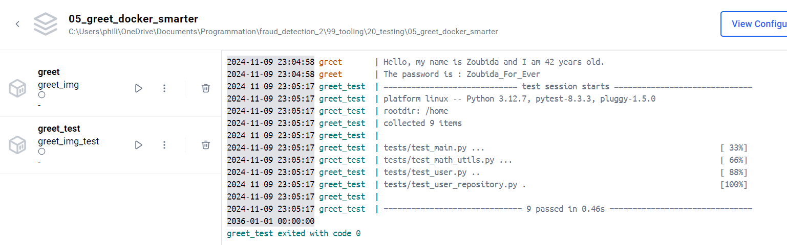
<p>


<!-- ###################################################################### -->
## Wait a minute...
* Above we can see 9 tests instead of 6
* It seems ``main.py`` is now tested  
* This is true. Take a look at ``./tests/test_main.py``


<!-- ###################################################################### -->
## Can we get a report ?
* Clean the test container and the test image

* This give an opportunity to show one of the benefits of the setup
    * Indeed, since the report only impact the tests, we only edit `./docker/requirements_4test.txt`
    * And add the ``pytest-html`` module to the list

```python
# requirements_4tests.txt

pytest
psycopg2-binary
sqlalchemy
pytest-html
```
Then we edit `docker-compose.yml` in order to :
1. add a directory where to store the reports. See `./test-reports:/home/test-reports` in ``volumes:`` 
2. pass the parameter to pytest. See the very last line `command: pytest ...`


```yaml
# docker-compose.yml

services:
  greet:
    image: greet_img
    build: 
      # determine the working directory on the host
      context: .
      dockerfile: docker/Dockerfile
    container_name: greet
    environment:
      - PASSWORD=${PASSWORD}
    volumes:
      - ./app:/home/app
      - ./img:/home/img
    # specifies the default working directory in the container at the time of service execution
    # ie independently of the WORKDIR directive defined in the Dockerfile
    working_dir: /home/app
    command: python main.py

  greet_test:
      image: greet_img_test
      build: 
        context: .
        dockerfile: docker/Dockerfile
        args:
          REQUIREMENTS_4TESTS: requirements_4tests.txt
      container_name: greet_test
      environment:
        - PASSWORD=${PASSWORD}
      volumes:
        - ./app:/home/app
        - ./img:/home/img
        - ./test-reports:/home/test-reports
      working_dir: /home
      command: pytest --junitxml=/home/test-reports/pytest-report.xml --html=/home/test-reports/pytest-report.html
```

Test the application :

```powershell
./test_app.ps1
```
A ``test-reports`` directory is created and 2 versions of the report are available. Open the ``.html`` version.

<p align="center">
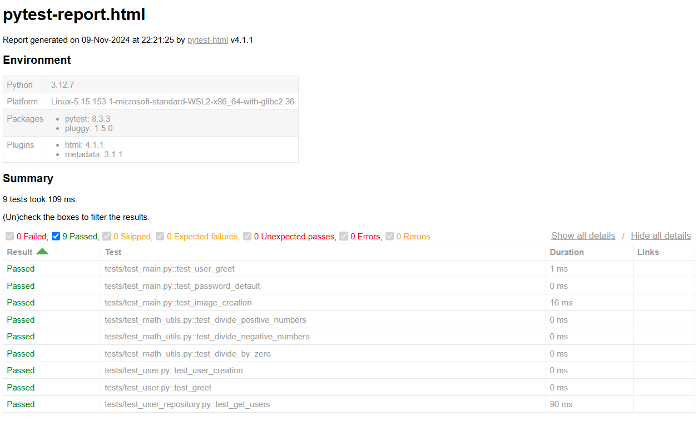
<p>


<!-- ###################################################################### -->
<!-- ###################################################################### -->
# The End of Our Road ? 

Do you remember Gladys Night, 1966?

At this point we can imagine a situation where :

* We have an application in the ``./app`` directory
    * To launch the app we invoke `./run_app.ps1`
    * The application runs in a Docker image 
    * As it becomes more sophisticated and need more modules, we add them into `./docker/requirements.txt`
* In parallel of the application development we write tests and store them in ``./tests`` 
    * To run the tests we invoke `./test_app.ps1`
    * The tests run in a Docker image 
    * As testing becomes more sophisticated and requires specific modules, we add them into the `./docker/requirements_4tests.txt`

From the maintenance point of view :
* We have only two scripts to either run the application (`run_app.ps1`) or test the application (`test_app.ps1`)
* We have a unique `docker-compose.yml` file to maintain for both situations (run and test)
* We have a unique `./docker/Dockerfile` file to maintain for both situations (run and test)
    * There are 2 requirements files which are maintained independently
    * ``requirements.txt`` : own the list of modules needed to run the app
    * ``requirements_4tests.txt`` : own the list of modules needed for testing (and testing only) 


Here is how the hierarchy of directories and files could look like :

```batch
./
│   docker-compose.yml
│   run_app.ps1
│   test_app.ps1
│   .gitignore            (to protect secrets.ps1)
│
├───app
│      main.py
│      user.py
│      secrets.ps1
│      __init__.py
│
├───docker
│       Dockerfile
│       requirements.txt
│       requirements_4tests.txt
│
└───tests
        test_main.py
        test_user.py
        __init__.py

```

<!-- From ``C:\Users\phili\OneDrive\Documents\Programmation\fraud_detection_2``
``pytest .\99_tooling\20_testing\05_greet_docker_smarter\`` -->
