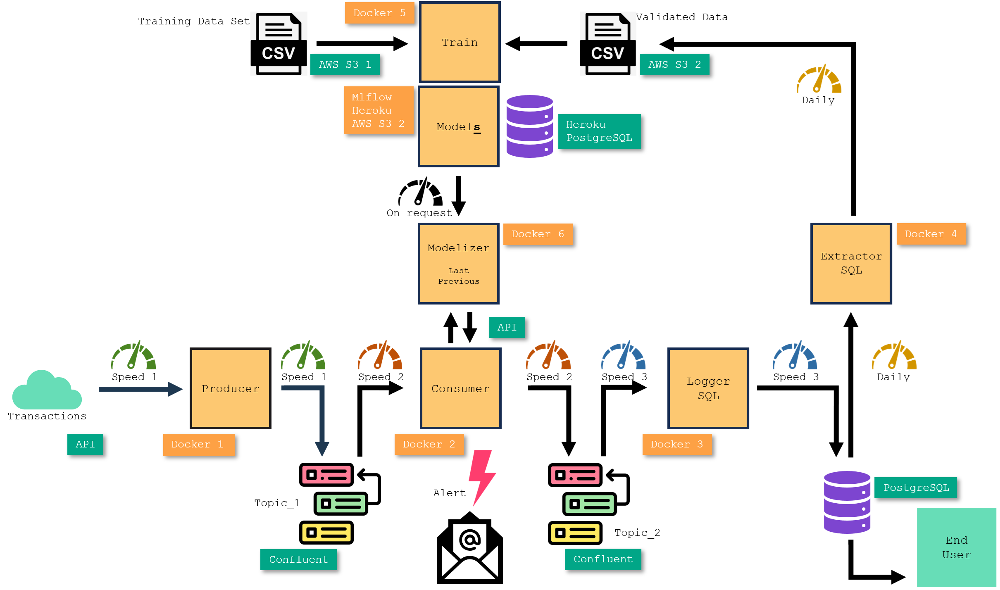

<!-- 
TODO : La doc pour faire tourner extractor_sql_dag
TODO : Faire un Evidenlty minimal histoire de voir si ça tourne
TODO : Gestion exception dans Fast PI si on passe les mauvais paramètres
TODO : Faire une vidéo
TODO : Faire un meta docker compose à la racine du projet
TODO : Faire un script de démarrage qui utilise le meta docker compose, lance chrome sur Heroku, pgAdmin, Confluent Topic 1 et 2...
TODO : Finir les tests (avec les 2 docker compose) qui sont expliqués dans 99_tooling\25_DinD\README.md
TODO : Dans 08_airflow\README.md, voir si on peut passer une chemin relatif dans 
docker run --rm `
    -v C:/Users/phili/OneDrive/Documents/Programmation/fraud_detection_2/06_extractor_sql_dag/app:/source `
    -v 08_airflow_extractor_sql_dag_shared_app:/mnt `
    busybox sh -c "cp -r /source/. /mnt/"

Trouver des ports
netstat -an | Select-String "LISTENING"

-->

<!-- ###################################################################### -->
<!-- ###################################################################### -->
# Fraud Detection 2 

### JEDHA Bootcamp - AI Architect - RNCP 38 777 - 2024


<!-- ###################################################################### -->
<!-- ###################################################################### -->
# Read the .pptx first
* Iff you read this ``README.md`` after Nov 28, 2024. Otherwise, I'm still working on the project and the slides may not be up to date.
* The content of the slides is mainly a cut-and-paste of what's available in the project notebook(s) and other files
* The idea is that the slides should help you understand the project and its results, guiding you step by step


<!-- ###################################################################### -->
<!-- ###################################################################### -->
# Read the README.md files in order
* The submodules of the project have their own 
    * directory 
    * ``README.md``
* At the end of each ``README.md`` files there is a **What's next?** section with a link to the next submodule and ``README.md`` file to read.
* Following the flow of the ``README.md`` you should have a better understanding of how the project was designed, the rationales behind some decisions and how the submodules works etc. 
* Otherwise, especially when reading for the first time, you may have difficulty understanding what is happening. For example, if you read the documentation of ``01_images_for_model_trainers`` before that of ``00_mlflow_tracking_server`` you risk asking yourself unnecessary questions in relation to the SQL base, the AWS S3... When in fact everything is explained in the previous ``README.md``.

<!-- ###################################################################### -->
## The key README.md you should read
* [Introduction.md](./introduction.md) : 
* [00_mlflow_tracking_server\README.md](./00_mlflow_tracking_server/README.md) : 
* [02_train_code\01_minimal\README.md](./02_train_code/01_minimal/README.md) : 
* [02_train_code\02_sklearn\01_template\README.md](./02_train_code/02_sklearn/01_template/README.md) :
* [03_producer\README.md](./03_producer/README.md) :
* [04_consumer\README.md](./04_consumer/README.md) :
* 05_logger_sql\README.md : Not yet finished
* 06_extractor_sql\README.md : Not yet written
* 07_modelizer\README.md : Not yet written
* [08_airflow\README.md](./08_airflow/README.md) :
* [99_tooling\20_testing\README.md](./99_tooling/20_testing/README.md) :
* [99_tooling\24_Jenkins_Testing\README.md](./99_tooling/24_Jenkins_Testing/README.md) : 
* [99_tooling\25_DinD\README.md](./99_tooling/25_DinD/README.md) : 


<!-- ###################################################################### -->
<!-- ###################################################################### -->
# Directories organization
```batch
./
├───00_mlflow_tracking_server
├───01_images_for_model_trainers
│   └───01_minimal_trainer
│   └───02_sklearn_trainer
├───02_train_code
│   └───01_minimal
│   └───01_sklearn
│       ├───01_template
│       └───99_smote_random_forest
├───03_producer
├───04_consumer
├───05_logger_sql
├───05_logger_sql_testable
├───06_extractor_sql
├───07_modelizer
├───98_EDA
├───99_tooling
├───assets
└───data 
```

## Content of the directories
Directories names start with a double digit numbers (e.g. 03_xxx) which helps understand how the different components of the project are serialized : First the MLflow Tracking Server, then build the image where to run the models, then the models... Even if EDA was the very first task it is numbered ``98_EDA`` and is at the bottom of the directory because it is not the main topic of this project.

### The modules are named according the architecture

You will learn more about the architecture in [./introduction.md](./introduction.md) but here is how the architecture of the project looks like :

<p align="center">

<p>


### Quick explanation for each sub-directory

* **00_mlflow_tracking_server** : everything needed to build & deploy mlflow tracking server. Runs in a Docker hosted on Heroku 
* **01_images_for_model_trainers** : everything needed to build docker images where the models to be trained will run. 
    * **01_minimal_trainer** : create the image for the minimal trainer.   
    * **02_sklearn_trainer** : create the image for sklearn trainers. 
* **02_train_code** : the models 
    * **01_minimal** : show how, with only 20 lines of code, a trainer can save artifacts, tags, model on MLflow Tracking Server. Runs in a Docker
    * **01_sklearn**
        * **01_template** : serve as a starting point for sklearn models. Based on MLproject. Runs in a Docker
        * **99_smote_random_forest** : the model used in the project. Based on MLproject. Runs in a Docker
* **03_producer** : read transactions with an API and store them in a Kafka topic (``topic_1``). Runs in a Docker
* **04_consumer** : read transactions from a topic_1, ask for prediction, store the result in a Kafka topic (``topic_2``). Runs in a Docker
* **05_logger_sql** : read (transaction + prediction) from topic_2 and store in SQL database hosted on Heroku. Runs in a Docker
* **05_logger_sql_testable** : Same as above + automatic unit testing with Jenkins. Tests runs in a Docker in a Jenkins Docker container.
* **06_extractor_sql** : daily, extracts from the SQL database the confirmed records, fill a ``validated.csv`` on AWS S3. Runs in a Docker
* **07_modelizer** : Exposes with thru an API the model. Called by the ``consumer`` to get the predictions, rollback model... Runs in a Docker
* **08_airflow** : Show how to use a module in its container inside a DAG.
* **09_evidently** : Not yet known at the time of writing this ``README.md``.
* **98_EDA** : EDA of project. A jupyter notebook
* **99_tooling** : 20+ differents sub-projects and other tests. Many of them have ``README.md``
* **assets** : png, pptx with drawings... Most of the subdirectories have an `assets` folder. They all serve the same purpose. Keep logs, png, csv... And keep the directory clean.
* **data** : a local copy of the dataset 


<!-- ###################################################################### -->

## Webliography
* Initial specification : https://app.jedha.co/course/final-projects-l/automatic-fraud-detection-l
* Mlflow Tracking server : https://fraud-detection-2-ab95815c7127.herokuapp.com/
* S3 with training dataset : https://lead-program-assets.s3.eu-west-3.amazonaws.com/M05-Projects/fraudTest.csv
* S3 with additionnal validated data for training : https://fraud-detection-2-bucket.s3.eu-west-3.amazonaws.com/data/validated.csv
* Topics on Confluent : https://confluent.cloud/home
* Previous version of the project (aka Fraud Detection 1): https://github.com/40tude/fraud_detection


<!-- ###################################################################### -->
<!-- ###################################################################### -->
# What's next ?
* Stay in this directory and read the [introduction.md](./introduction.md) file 
    * The previous link (``introduction.md``) may not work on GitHub but it works like a charm locally in VSCode or in a Web browser
    * [Try this](https://github.com/40tude/fraud_detection_2/tree/main/introduction.md)


<!-- ###################################################################### -->
<!-- ###################################################################### -->
# About contributions
This project is developed for personal and educational purposes. Feel free to explore and use it to enhance your own learning in machine learning.

Given the nature of the project, external contributions are not actively sought nor encouraged. However, constructive feedback aimed at improving the project (in terms of speed, accuracy, comprehensiveness, etc.) is welcome. Please note that this project is being created as a hobby and is unlikely to be maintained once my initial goal has been achieved.


<!-- 
Start-Process "chrome.exe" -ArgumentList "https://www.example1.com", "https://www.example2.com", "https://www.example3.com"
Start-Process "chrome.exe" -ArgumentList "--new-window", "https://www.example.com"


-->